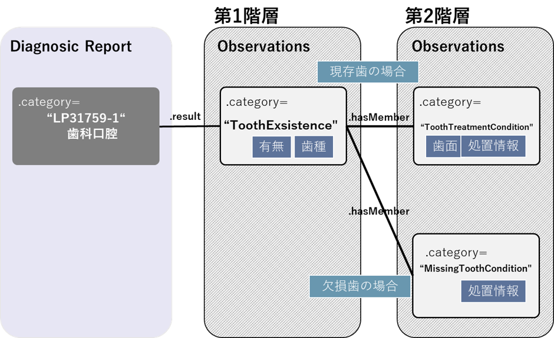

# JP Core DiagnosticReport DentalOral Profile - HL7 FHIR JP Core ImplementationGuide v1.3.0-dev

* [**Table of Contents**](toc.md)
* [**Artifacts Summary**](artifacts.md)
* **JP Core DiagnosticReport DentalOral Profile**

## Resource Profile: JP Core DiagnosticReport DentalOral Profile 

* **項目**: *定義URL*
  * **内容**: http://jpfhir.jp/fhir/core/StructureDefinition/JP_DiagnosticReport_DentalOral
* **項目**: *Version*
  * **内容**: 1.3.0-dev
* **項目**: *Name*
  * **内容**: JP_DiagnosticReport_DentalOral
* **項目**: *Title*
  * **内容**: JP Core DiagnosticReport DentalOral Profile
* **項目**: *Status*
  * **内容**: Active ( 2025-07-30 )
* **項目**: *Copyright*
  * **内容**: Copyright Japan FHIR Implementation Infrastructure Study Group in Japan Association of Medical Informatics (JAMI) 一般社団法人日本医療情報学会FHIR国内実装基盤研究会

 
このプロファイルはDiagnosticReportリソースに対して、口腔診査の結果（口腔所見）のデータを送受信するための制約と拡張を定めたものである。 

本プロファイルは、DiagnosticReportリソースのうち、口腔診査の結果における患者、患者群、機器、場所およびこれから得られた画像に対して実施された診断結果またはその解釈を示す口腔所見を表現するリソースの定義である。ここでは、DiagnosticReportリソースに対して本プロファイルに準拠する場合に必須となる要素や、サポートすべき拡張、用語、検索パラメータを定義する。口腔所見は、依頼者や診査の情報などの臨床的背景のほか、いくつかの計測値、画像、テキストおよびコード化された解釈により構成される。

## 背景および想定シナリオ

本プロファイルは、以下のようなユースケースを想定している。

* 歯科診療所など歯科診療において、口腔診査の結果の記録に利用する。
* 歯科診療所、病院の診療記録、健康診断の結果などに基づき、身元確認のために共有する歯式情報

## スコープ

本プロファイルのスコープは、口腔内の硬組織のうち、歯列を対象とした報告書とする。現状は、舌などの軟組織はスコープ外とする。

本プロファイルでは口腔診査に関わる複数の情報を一つのグループとして表現するため、一つの情報項目を表現するObservationリソースを必要な情報項目数分用意し、それらを1つにグルーピングして扱う。

具体的には .hasMemberエレメントに対して関連する下位の本プロファイルを適用したObservationリソースを関連づけることでグルーピングを行う。口腔診査で表現する情報群については、図にて表現されるように、検査結果レポートに相当する JP_DiagnosticReport_Dentalに（第0層）に対し、

* 第1層：「特定の歯の有無・状態（ToothExistence）」
* 第2層：「現存歯の処置状態（ToothTreatmeantCondition）」、「欠損歯の処置状態（MissingToothCondition）」

という情報要素を表現する本プロファイルを適用したObservationリソースを用意する。それぞれの層では口腔診査を実施した際に得られる以下の情報が収容されることを想定している。



※ 図中には、categolyの第３コードを表示している

## プロファイル定義

**Usages:**

* Examples for this Profile: [DiagnosticReport/jp-diagnosticreport-dentaloral-example-1](DiagnosticReport-jp-diagnosticreport-dentaloral-example-1.md) and [DiagnosticReport/jp-diagnosticreport-dentaloral-example-2](DiagnosticReport-jp-diagnosticreport-dentaloral-example-2.md)

You can also check for [usages in the FHIR IG Statistics](https://packages2.fhir.org/xig/jpfhir.jp.core|current/StructureDefinition/jp-diagnosticreport-dentaloral)

### プロファイル詳細

 [Description of Profiles, Differentials, Snapshots and how the different presentations work](http://build.fhir.org/ig/FHIR/ig-guidance/readingIgs.html#structure-definitions). 

 

Other representations of profile: [CSV](StructureDefinition-jp-diagnosticreport-dentaloral.csv), [Excel](StructureDefinition-jp-diagnosticreport-dentaloral.xlsx), [Schematron](StructureDefinition-jp-diagnosticreport-dentaloral.sch) 

### 必須要素

本プロファイルでは、次の要素を持たなければならない。

* status : レポートの状態・進捗状況は必須
* category : レポートのカテゴリは、LP31759-1 "歯科口腔" を固定値として必須
* code : レポートの名前/コードは、32453-3 を固定値として必須
* effectiveDateTime : レポート作成日時は必須

### Extensions定義

本プロファイルで追加定義された拡張はない。

### 制約一覧

本プロファイルで追加定義された制約はない。

## 利用方法

### OperationおよびSearch Parameter 一覧

#### Search Parameter一覧

口腔診査レポートを対象とした特有のユースケースとして、下記2つが想定される。

* **ケース1「結果の記録時や診療情報提供時の特定患者の検索」（患者単位での探索）** 
* 検索パラメータ：patient
* DiagnosticReport.subjectがpatientリソースを指している場合の検索式の例：
 `GET [base]/DiagnosticReport?subject:Patient.name=peter`
 
* **ケース2「身元確認のときの検索」（患者横断での探索）** 
* 検索パラメータ：result, issued
* DiagnosticReport.resultで参照するObservationリソースにおいて、第1階層（有・無）だけでなく第2階層（歯式や歯面、処置状態）などを条件として検索するユースケースが想定される。
* 例えば、『右側上顎第２小臼歯』(TB-2-1011)の現存歯の処置状態が『全部修復（全部金属冠・銀色）（ＦＭＣ）』(TP-21-01)と記載された『2000年1月1日以降』に作成されたレポートを取得する検索式： 

```
GET /DiagnosticReport?
issued=ge2000-01-01
&result.bodySite.coding.system=http://jpfhir.jp/fhir/core/CodeSystem/JP_DentalBodySite_CS
&result.bodySite.coding.code=TB-2-1011
&result.component.code=http://jpfhir.jp/fhir/core/CodeSystem/JP_DentalPresentTeethObservation_CS|TP-21-01

```

 
* 上記のようにレポートから下層に紐付くリソース（result要素に紐付くObservationリソース）の要素の値で条件検索する方法以外に、下記の様に2段階に分けて検索することも出来る。 
* Step.1：条件に合致するObservationリソース一覧を取得する検索式 

```
GET /Observation?
bodySite.coding.system=http://jpfhir.jp/fhir/core/CodeSystem/JP_DentalBodySite_CS
&bodySite.coding.code=TB-2-1011
&component.code=http://jpfhir.jp/fhir/core/CodeSystem/JP_DentalPresentTeethObservation_CS|TP-21-01

```

 
* Step.2：取得したObservationのid（例：1234, 5678 の2つの場合）を基にレポートを取得する検索式 

```
GET /DiagnosticReport?
issued=ge2000-01-01
&result.hasMember=Observation/1234,Observation/5678`

```

 
 
 

### サンプル

* [**口腔診査レポート1（現存歯）**](DiagnosticReport-jp-diagnosticreport-dentaloral-example-1.md)
* [**口腔診査レポート2（欠損歯）**](DiagnosticReport-jp-diagnosticreport-dentaloral-example-2.md)

なお、result要素の参照先であるObservationリソースは [公益社団法人 日本歯科医師会 「口腔状態モデルケースとコード化例」（2023年3月）](https://www.jda.or.jp/dentist/program/pdf/Oral-examination-Information-Standard-Code_v1.02-proportional.pdf)の記載例１（現存歯の処置歯3本）、記載例１１（歯冠破折２本）、記載例１２（欠損歯3本）を参考にサンプルデータを作成した。

## その他、参考文献、リンク等

* [公益社団法人 日本歯科医師会 「口腔診査情報標準コード仕様 Ver.1.02」（2023年3月）](https://www.jda.or.jp/dentist/program/pdf/Oral-examination-Information-Standard-Code_v1.02.pdf)
* [公益社団法人 日本歯科医師会 「口腔状態モデルケースとコード化例」（2023年3月）](https://www.jda.or.jp/dentist/program/pdf/Oral-examination-Information-Standard-Code_v1.02-proportional.pdf)

本実装ガイドへのご質問・ご指摘については、
[GitHub Issue](https://github.com/jami-fhir-jp-wg/jp-core-v1x/issues)および
[GitHub PullRequest](https://github.com/jami-fhir-jp-wg/jp-core-v1x/pulls)にて受け付けている。

## Resource Content

```json
{
  "resourceType" : "StructureDefinition",
  "id" : "jp-diagnosticreport-dentaloral",
  "url" : "http://jpfhir.jp/fhir/core/StructureDefinition/JP_DiagnosticReport_DentalOral",
  "version" : "1.3.0-dev",
  "name" : "JP_DiagnosticReport_DentalOral",
  "title" : "JP Core DiagnosticReport DentalOral Profile",
  "status" : "active",
  "date" : "2025-07-30",
  "publisher" : "FHIR Japanese implementation research working group in Japan Association of Medical Informatics (JAMI)",
  "contact" : [
    {
      "name" : "FHIR Japanese implementation research working group in Japan Association of Medical Informatics (JAMI)",
      "telecom" : [
        {
          "system" : "url",
          "value" : "http://jpfhir.jp"
        },
        {
          "system" : "email",
          "value" : "office@hlfhir.jp"
        }
      ]
    }
  ],
  "description" : "このプロファイルはDiagnosticReportリソースに対して、口腔診査の結果（口腔所見）のデータを送受信するための制約と拡張を定めたものである。",
  "jurisdiction" : [
    {
      "coding" : [
        {
          "system" : "urn:iso:std:iso:3166",
          "code" : "JP",
          "display" : "Japan"
        }
      ]
    }
  ],
  "copyright" : "Copyright Japan FHIR Implementation Infrastructure Study Group in Japan Association of Medical Informatics (JAMI) 一般社団法人日本医療情報学会FHIR国内実装基盤研究会",
  "fhirVersion" : "4.0.1",
  "mapping" : [
    {
      "identity" : "workflow",
      "uri" : "http://hl7.org/fhir/workflow",
      "name" : "Workflow Pattern"
    },
    {
      "identity" : "v2",
      "uri" : "http://hl7.org/v2",
      "name" : "HL7 v2 Mapping"
    },
    {
      "identity" : "rim",
      "uri" : "http://hl7.org/v3",
      "name" : "RIM Mapping"
    },
    {
      "identity" : "w5",
      "uri" : "http://hl7.org/fhir/fivews",
      "name" : "FiveWs Pattern Mapping"
    }
  ],
  "kind" : "resource",
  "abstract" : false,
  "type" : "DiagnosticReport",
  "baseDefinition" : "http://jpfhir.jp/fhir/core/StructureDefinition/JP_DiagnosticReport_Common",
  "derivation" : "constraint",
  "differential" : {
    "element" : [
      {
        "id" : "DiagnosticReport",
        "path" : "DiagnosticReport",
        "short" : "診断レポート-依頼情報、１項目単位の結果、画像、解釈、およびフォーマットされたレポートの組み合わせ　【JP Core仕様】口腔診査結果レポートのプロフィール",
        "definition" : "患者、患者のグループ、デバイス、場所、これらから派生した対象に対して実行された診断的検査の結果と解釈。レポートには、依頼情報や依頼者情報などの臨床コンテキスト（文脈）、および１項目単位の結果、画像、テキストとコード化された解釈、および診断レポートのフォーマットされた表現のいくつかの組み合わせが含まれる。\r\n【JP Core仕様】口腔診査結果レポートのプロファイル",
        "comment" : "これは単一のレポートを格納することを目的としており、複数のレポートを含む要約情報の表示に使用するのには適していない。たとえば、このリソースは、検査結果の累積レポート形式やシーケンスの詳細な構造化レポート用に作られていない。\r\n【JP Core仕様】DiagnosticReportリソースの共通プロファイル"
      },
      {
        "id" : "DiagnosticReport.identifier",
        "path" : "DiagnosticReport.identifier",
        "short" : "レポートを識別するビジネス識別子 【JP Core仕様】当該検査項目に対して、施設内で割り振られる一位の識別子があればそちらを使用する。",
        "definition" : "レポートを識別するビジネス識別子 【JP Core仕様】当該検査項目に対して、施設内で割り振られる一位の識別子があればそちらを使用する。",
        "comment" : "例：電子カルテ等のオーダ番号、レポート番号、実施日に連番を付加した番号など"
      },
      {
        "id" : "DiagnosticReport.basedOn",
        "path" : "DiagnosticReport.basedOn",
        "short" : "元になった検査や診断の依頼  【JP Core仕様】オーダ発生元のServiceRequestまたはCarePlanへの参照",
        "definition" : "元になった検査や診断の依頼  【JP Core仕様】オーダ発生元のServiceRequestまたはCarePlanへの参照",
        "type" : [
          {
            "code" : "Reference",
            "targetProfile" : [
              "http://hl7.org/fhir/StructureDefinition/CarePlan",
              "http://hl7.org/fhir/StructureDefinition/ServiceRequest"
            ]
          }
        ]
      },
      {
        "id" : "DiagnosticReport.status",
        "path" : "DiagnosticReport.status",
        "short" : "診断レポートのステータス  【JP Core仕様】レポートの記載状況をバインディングされたコードセットから必ず一つ選ぶ。",
        "definition" : "診断レポートのステータス  【JP Core仕様】レポートの記載状況をバインディングされたコードセットから必ず一つ選ぶ。"
      },
      {
        "id" : "DiagnosticReport.category",
        "path" : "DiagnosticReport.category",
        "slicing" : {
          "discriminator" : [
            {
              "type" : "pattern",
              "path" : "$this"
            }
          ],
          "rules" : "open"
        },
        "short" : "サービスカテゴリー SS-MIX2拡張ストレージ構成の説明と構築ガイドラインに従う",
        "definition" : "サービスカテゴリー SS-MIX2拡張ストレージ構成の説明と構築ガイドラインに従う",
        "min" : 1
      },
      {
        "id" : "DiagnosticReport.category:first",
        "path" : "DiagnosticReport.category",
        "sliceName" : "first",
        "comment" : "【JP Core仕様】レポートカテゴリーとして、LoincコードのLP31759-1（歯科口腔）を使用する。",
        "min" : 1,
        "max" : "1",
        "patternCodeableConcept" : {
          "coding" : [
            {
              "system" : "http://loinc.org",
              "code" : "LP31759-1",
              "display" : "歯科口腔"
            }
          ]
        },
        "binding" : {
          "strength" : "required",
          "valueSet" : "http://jpfhir.jp/fhir/core/ValueSet/JP_DiagnosticReportCategory_VS"
        }
      },
      {
        "id" : "DiagnosticReport.category:first.coding.code",
        "path" : "DiagnosticReport.category.coding.code",
        "min" : 1
      },
      {
        "id" : "DiagnosticReport.code",
        "path" : "DiagnosticReport.code",
        "short" : "診断レポート種別「口腔診査報告書」を表す文書コード",
        "definition" : "診断レポート種別「口腔診査報告書」を表す文書コード",
        "patternCodeableConcept" : {
          "coding" : [
            {
              "system" : "http://jpfhir.jp/fhir/core/CodeSystem/JP_DocumentCodes_CS",
              "code" : "32453-3",
              "display" : "口腔診査報告書"
            }
          ]
        }
      },
      {
        "id" : "DiagnosticReport.subject",
        "path" : "DiagnosticReport.subject",
        "short" : "レポートの対象、常にではないが、通常は患者  【JP Core仕様】Patientリソースを参照",
        "definition" : "レポートの対象、常にではないが、通常は患者  【JP Core仕様】Patientリソースを参照",
        "type" : [
          {
            "code" : "Reference",
            "targetProfile" : ["http://jpfhir.jp/fhir/core/StructureDefinition/JP_Patient"]
          }
        ]
      },
      {
        "id" : "DiagnosticReport.encounter",
        "path" : "DiagnosticReport.encounter",
        "short" : "依頼時における診療イベント（受診など） 【JP Core仕様】このレポートを書く切っ掛けとなるEncounterリソースを参照",
        "definition" : "依頼時における診療イベント（受診など） 【JP Core仕様】このレポートを書く切っ掛けとなるEncounterリソースを参照",
        "comment" : "例：診療、歯科健診（検診）、身元不明者調査 ※JP Coreに網羅されていない"
      },
      {
        "id" : "DiagnosticReport.effective[x]",
        "path" : "DiagnosticReport.effective[x]",
        "short" : "臨床的に関連する時刻または時間  【JP Core仕様】レポート作成日時",
        "definition" : "臨床的に関連する時刻または時間  【JP Core仕様】レポート作成日時",
        "comment" : "観測値が関連する時間または期間。レポートの対象が患者である場合、これは通常、読影開始の時間であり、日付／時刻自体のみ提供される。実施日時。",
        "type" : [
          {
            "code" : "dateTime"
          }
        ]
      },
      {
        "id" : "DiagnosticReport.issued",
        "path" : "DiagnosticReport.issued",
        "short" : "このバージョンが作成された日時  【JP Core仕様】最新のレポート確定日時",
        "definition" : "このバージョンが作成された日時  【JP Core仕様】最新のレポート確定日時"
      },
      {
        "id" : "DiagnosticReport.performer",
        "path" : "DiagnosticReport.performer",
        "short" : "レポート内容に責任をもつ診断的サービス  【JP Core仕様】レポート確定者",
        "definition" : "レポート内容に責任をもつ診断的サービス  【JP Core仕様】レポート確定者",
        "comment" : "例：歯科医師など"
      },
      {
        "id" : "DiagnosticReport.resultsInterpreter",
        "path" : "DiagnosticReport.resultsInterpreter",
        "short" : "結果の一次解釈者  【JP Core仕様】レポートの作成者",
        "definition" : "結果の一次解釈者  【JP Core仕様】レポートの作成者",
        "comment" : "例：歯科医師、歯科研修医など"
      },
      {
        "id" : "DiagnosticReport.specimen",
        "path" : "DiagnosticReport.specimen",
        "short" : "診断レポートのもとになった検体に関する情報  【JP Core仕様】未使用",
        "definition" : "診断レポートのもとになった検体に関する情報  【JP Core仕様】未使用"
      },
      {
        "id" : "DiagnosticReport.result",
        "path" : "DiagnosticReport.result",
        "short" : "診断レポートの一部となるObservationsに関する情報  【JP Core仕様】検査結果",
        "definition" : "診断レポートの一部となるObservationsに関する情報  【JP Core仕様】検査結果",
        "type" : [
          {
            "code" : "Reference",
            "targetProfile" : [
              "http://jpfhir.jp/fhir/core/StructureDefinition/JP_Observation_DentalOral_ToothExistence"
            ]
          }
        ]
      },
      {
        "id" : "DiagnosticReport.media",
        "path" : "DiagnosticReport.media",
        "short" : "診断レポートに関連づけられたメディアに関する情報  【JP Core仕様】このレポートに関連づけられたキー画像",
        "definition" : "診断レポートに関連づけられたメディアに関する情報  【JP Core仕様】このレポートに関連づけられたキー画像"
      },
      {
        "id" : "DiagnosticReport.media.link",
        "path" : "DiagnosticReport.media.link",
        "comment" : "例：口腔内写真、jpgで保存されている画像、3Dデータなど"
      },
      {
        "id" : "DiagnosticReport.conclusion",
        "path" : "DiagnosticReport.conclusion",
        "short" : "簡潔かつ臨床的な文脈で表現した診断レポートの要約結論（解釈、インプレッション） 【JP Core仕様】原則、未使用。レセプト傷病名などテキスト型で記載も可能。",
        "definition" : "簡潔かつ臨床的な文脈で表現した診断レポートの要約結論（解釈、インプレッション） 【JP Core仕様】原則、未使用。レセプト傷病名などテキスト型で記載も可能。"
      },
      {
        "id" : "DiagnosticReport.conclusionCode",
        "path" : "DiagnosticReport.conclusionCode",
        "short" : "診断レポートの要約結論（解釈、インプレッション）を表すコード  【JP Core仕様】原則、未使用。レセプト傷病名などのCodeableConcept型で定義も可能。",
        "definition" : "診断レポートの要約結論（解釈、インプレッション）を表すコード  【JP Core仕様】原則、未使用。レセプト傷病名などのCodeableConcept型で定義も可能。"
      }
    ]
  }
}

```
