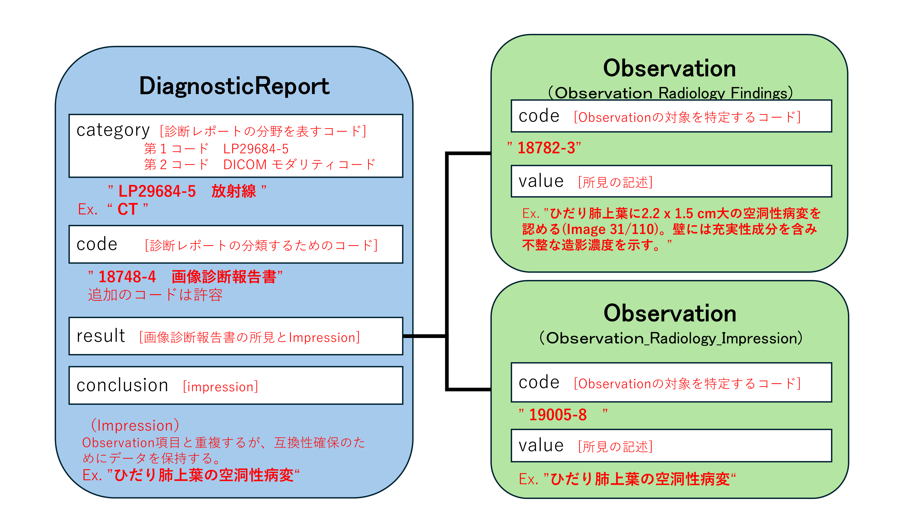

# JP Core DiagnosticReport Radiology Profile - HL7 FHIR JP Core ImplementationGuide v1.3.0-dev

* [**Table of Contents**](toc.md)
* [**Artifacts Summary**](artifacts.md)
* **JP Core DiagnosticReport Radiology Profile**

## Resource Profile: JP Core DiagnosticReport Radiology Profile 

* **項目**: *定義URL*
  * **内容**: http://jpfhir.jp/fhir/core/StructureDefinition/JP_DiagnosticReport_Radiology
* **項目**: *Version*
  * **内容**: 1.3.0-dev
* **項目**: *Name*
  * **内容**: JP_DiagnosticReport_Radiology
* **項目**: *Title*
  * **内容**: JP Core DiagnosticReport Radiology Profile
* **項目**: *Status*
  * **内容**: Active ( 2025-07-30 )
* **項目**: *Copyright*
  * **内容**: Copyright Japan FHIR Implementation Infrastructure Study Group in Japan Association of Medical Informatics (JAMI) 一般社団法人日本医療情報学会FHIR国内実装基盤研究会

 
このプロファイルはDiagnosticReportリソースに対して、放射線検査報告書（レポート）のデータを送受信するための制約と拡張を定めたものである。 

本プロファイルは、[DiagnosticReportリソース](StructureDefinition-jp-diagnosticreport-radiology.md) のうち、放射線画像検査における患者、患者群、機器、場所、およびこれらから得られた画像に対して実施された診断結果またはその解釈を示す「報告書」を表現するリソースの定義である。ここでは、DiagnosticReport リソースに対して本プロファイルに準拠する場合に必須となる要素や、サポートすべき拡張、用語、検索パラメータを定義する。 報告書は、依頼者や撮影の情報などの臨床的背景のほか、いくつかの計測値、画像、テキストおよびコード化された解釈、テンプレート化された診断報告書により構成される。

## 背景および想定シナリオ

本プロファイルは、以下のようなユースケースを想定する。

* 施設内で発生するオーダをもとに実施される画像検査に対する診断レポートの保存
* 他のリソースからの放射線検査レポートの参照
 （例：[ImagingStudyリソース](StructureDefinition-jp-imagingstudy-radiology.md)） や[ServiceRequestリソース](https://www.hl7.org/fhir/R4/servicerequest.html) のreasonReference エレメントで参照される放射線検査レポート）

## スコープ

放射線検査レポートで取り扱う診断報告書は、検査の終了後に、検査の診断結果として提供される一連の情報である。 この情報には、テキストレポート、画像、コード、および計測値などが含まれる。この組み合わせは、診断手順や特定の検査の結果の性質に応じて変化する。FHIRでは、レポートはドキュメント、RESTful API、メッセージングフレームワークなど、さまざまな方法で伝達することができる。これらの方法に含まれるのは、DiagnosticReportリソースそのものである。

DiagnosticReportリソースは、診断レポート自体の他に、患者など対象者に関する情報を持つ。また、オーダに関する情報や所見の詳細、画像を参照することもできる。レポートの結論は、テキスト、構造化されたコード化データ、またはPDFなどの完全に標準化された添付レポートとして表現することができる。

もっとも典型的にはレポートの診断結果をDiagnosticReport.conclusionエレメントに保持しDiagnosticReport.presentedFormエレメントでレポート全体のデータを持つ。また、キー画像等の添付データはDiagnosticReport.mediaエレメントにMediaリソースへのリンクとして保持する。

レポート全体のデータは、レポーティングシステム等により作成された多彩な表現型（PDF, RichText, xhtml等）でBase64のAttachmentとして提供される。ただし、結果参照や検索の汎用性を担保しHuman readableな形で提供されることを目的とし、レポートの内容はDomainResourceであるDiagnosticReport.textエレメントにも格納される。 また、構造化されたレポートの内容はDiagnosticReport.resultエレメントに「所見 (findings)」、「結論、インプレッション (impression)」を表すObservationリソースへの参照として定義される。「結論、インプレッション (impression)」のObservationリソースの内容は後方互換のために、DiagnosticReport.conclusionにも保持されることが望ましい。

DiagnosticReportリソースは、過去の結果（リソース内での過去および現在の結果）の提示をサポートすることを意図していない。DiagnosticReportリソースは、シーケンスの構造化を含めレポートの完全なサポートをまだ提供できていないが、将来実装される予定である。

## 関連するプロファイル

以下のリソースは関連情報として presentedForm にて参照されるレポート内に保持される可能性がある。ただし、レポートシステムの仕様に依存するため、レポートシステムでは各リソースとの相互運用性の確保に配慮することが求められる。

* [患者 (`Patient`)](StructureDefinition-jp-patient.md)
* [依頼医，読影医，確定医など (`Practitioner`)](StructureDefinition-jp-practitioner.md)
* [身長 (`Observation`)](StructureDefinition-jp-observation-bodymeasurement.md)
* [体重 (`Observation`)](StructureDefinition-jp-observation-bodymeasurement.md)
* [アレルギー情報 (`AllergyIntorelance`)](StructureDefinition-jp-allergyintolerance.md)
* [キー画像 (`media`)](http://www.hl7.org/fhir/R4/media.html)
* [尿素窒素（BUN）(`Observation`)](StructureDefinition-jp-observation-labresult.md)
* [クレアチニン（Cre）(`Observation`)](StructureDefinition-jp-observation-labresult.md)
* 感染症情報 [(`RiskAssessment`)](https://hl7.org/fhir/R4/riskassessment.html) あるいは [(`Observation`)](StructureDefinition-jp-observation-labresult.md)

運用のフローに関連する TASK、Procedure 等のリソース定義についてはここでは触れない。 なお、読影医・確定医の専門医資格情報については、Practitioner.qualificationエレメントでの対応を検討している。

## プロファイル定義

**Usages:**

* Examples for this Profile: [DiagnosticReport/jp-diagnosticreport-radiology-example-1](DiagnosticReport-jp-diagnosticreport-radiology-example-1.md)
* CapabilityStatements using this Profile: [JP Core Client CapabilityStatement](CapabilityStatement-jp-client-capabilitystatement.md) and [JP Core Server CapabilityStatement](CapabilityStatement-jp-server-capabilitystatement.md)

You can also check for [usages in the FHIR IG Statistics](https://packages2.fhir.org/xig/jpfhir.jp.core|current/StructureDefinition/jp-diagnosticreport-radiology)

### プロファイル詳細

 [Description of Profiles, Differentials, Snapshots and how the different presentations work](http://build.fhir.org/ig/FHIR/ig-guidance/readingIgs.html#structure-definitions). 

 

Other representations of profile: [CSV](StructureDefinition-jp-diagnosticreport-radiology.csv), [Excel](StructureDefinition-jp-diagnosticreport-radiology.xlsx), [Schematron](StructureDefinition-jp-diagnosticreport-radiology.sch) 

### 必須要素

次のデータ項目は必須（**SHALL**）である。

* identifier : レポートの識別子 
* status : レポートの状態・進捗状況
* code : レポートの種別 （[JP Core Document Codes Diagnostic](https://jpfhir.jp/fhir/core/ValueSet/JP_DocumentCodes_DiagnosticReport_VS.html)に記載されているLOINCコード(18748-4) "Diagnostic imaging study" を指定）
* category : カテゴリとモダリティを表すコード （Radiology(LP29684-5)を第一コードとし、モダリティを示すDICOMコード[JP Core DICOM Modality Codes][JP_DICOMModaliy_VS]を第二コードとして指定する。第二コードは複数のモダリティを許容するため、複数のコードの指定が想定される。）

### MustSupport

次のデータは送信システムに存在する場合はサポートされなければならないことを意味する（Must Support）。

* _text : レポートの所見を含むnarrativeデータ（簡易表示に用いられる）
* basedOn : レポートあるいは画像検査のServiceRequest
* subject : 患者リソース(Patient)への参照。殆どの場合存在するが、緊急検査等で患者リソースが確定していない場合が想定される
* effectiveDateTime : レポート作成日時
* issued : レポート確定日時
* performer : Practitionerでレポートの関係者（作成者、読影者、確定者など）を列挙
* resultInterpreter : Practitionerでレポート確定者を示す
* imagingStudy : 診断の対象となる画像
* result : 所見(findings)や診断の結果(impression) を示すObservationリソースへの参照。
* link : キーイメージの参照先
* conclusion : 診断の結果、impression
* presentedForm : レポート本体（全体のイメージあるいは所見等のテキスト）

imagingStudyエレメントはCardinalityが0..*で 0 が許容されているが、放射線レポートでは画像が必ず存在することから、検査実施後には必須（複数の可能性もあり）である。

### Extensions定義

本プロファイルで追加定義された拡張はない。

## 注意事項

### Text

JP Core V1.2からは、診断、所見などの観察結果についてはDomainResourceのtext要素ではなく、原則としてresult要素が参照するObservationリソースに格納する方針に改めたので注意されたい。

依頼情報や患者基本情報などを含むレポート全体のデータは、presentedForm要素に、base64で符号化されたバイナリデータとして格納される。そこで、所見を中心としたhuman-readableな[narrative](https://www.hl7.org/fhir/R4/narrative.html)データを、主にレポートの見読性と検索性の向上を目的に、JP Core V1.1.2ではDiagnosticReportのDomainResourceの1つであるtext要素に格納することを推奨することとして本プロファイルを初期リリースした。 (レポートの詳細はpresentedForm要素に格納されるレポート本体での確認を前提とする)

しかし、多くのクラウドシステムではDomainResource.textを検索対象とできない可能性があることが判明したため、JP Core V1.2以降では、V1.1.2での実装から方針を転換し、US Coreの運用方法に倣い、DiagnosticReport.result要素が参照する[JP Core Observation Radiology Findings](StructureDefinition-jp-observation-radiology-findings.md)リソースおよび[JP Core Observation Radiology Impression](StructureDefinition-jp-observation-radiology-impression.md)に、診断レポートの一部となる観察結果（診断、所見など）の情報を記載し、検索対象のリソースとして用いることとした。

従って、V1.2以降では、.text要素に記述した内容はレポートの内容に対する簡易的な表示には利用されるが、サーバ上での検索性は担保されない可能性を考慮して実装することを推奨する。 また、所見(findings)や診断の結果(impression)は対応するObservationリソースに内容が保持されるので、全文検索等の目的で構造化された情報を利用する場合はこれらを参照すること。



具体的な構造については [**放射線読影レポート**](DiagnosticReport-jp-diagnosticreport-radiology-example-1.md)を参照のこと

### CategoryとCode

Codeエレメントは一つの値のみが許容される。一方でIVR等の手技で血管造影検査と超音波検査あるいはCT検査が併用されることがあるように、放射線画像検査では複数のモダリティと組み合わせた複合的な検査治療手技が構成されることがある。すべての組み合わせのコードを準備あるいは列挙することは困難であるため、本バージョンの実装ガイドでは放射線検査に対する画像診断レポートにはCodeに 18748-4（画像検査報告書）を指定することを原則としている。 Codeエレメントに利用されるコードとして[JP Core Document Codes Diagnostic](https://jpfhir.jp/fhir/core/ValueSet/JP_DocumentCodes_DiagnosticReport_VS.html) に定義されるコードシステムが用意されているが、粒度の細かいコードはSS-MIX2等で既に定義されているデータとの後方互換を保つ目的で用意されている点に留意が必要である。

Codeエレメントで複合的要素を表現できない点を考慮し、Categoryエレメントにて、複数のモダリティコードを指定できるように設計している点をあわせて確認すること。

### Identifier

Identifier のデータタイプはオーダ依頼者であるPlacerあるいはオーダの実施者であるFiller（HL7 Version 2 Messaging Standardにて'Placer'あるいは'Filler'として知られている）によって割り当てられた識別子を区別するために利用されるtypeエレメントを持っている。typeエレメントは以下の様に利用する。

#### Placerの場合

```
{
  "identifier":[{
    "type":{
      "coding":{
        "system":"http://terminology.hl7.org/CodeSystem/v2-0203",
        "code":"PLAC"
      },
      "text":"Placer Identifier"
    },
    "system":"http://abc-hospital.local/fhir/PlacerIdentifier",
    "value":"2345234234234"
  }]
}

```

#### Fillerの場合

```
{
  "identifier":[{
    "type":{
      "coding":{
        "system":"http://terminology.hl7.org/CodeSystem/v2-0203",
        "code":"FILL"
      },
      "text":"Filler Identifier"
    },
    "system":"http://abc-hospital.local/fhir/FillerIdentifier",
    "value":"567890"
  }]
}

```

DiagnosticReport_Radiology リソースではtypeエレメントを明示する際にはオーダ番号やレポート番号が格納される可能性がある点に留意して対応することが重要である。

### 時間の指定

このプロファイルのリソースでは、effective[x]エレメントにはレポート作成時間を[dateTime](https://www.hl7.org/fhir/R4/datatypes.html#dateTime)で格納する。

### 関連するObservation

DiagnosticReport.resultエレメントには所見(findings)や診断の結果(impression)を示すObservationリソースが含まれるが、加えて関連する検体検査や画像上の計測値などをしめすObservationリソースを含むことができる。

### 参照画像

ImagingStudyやmediaは多少オーバーラップするが、使用される目的が異なる。用途に応じて使い分けること。DiagnosticReportではDICOM画像への参照としてImagingStudyが利用され、キー画像としてmediaが参照される。

### 診断報告書のステータス

* 診断レポートを使用するアプリケーションでは、更新された (改訂された) レポートに注意を払い、取り消されたレポートが適切に処理されるようにする必要がある。
* 診断レポートを提供するアプリケーションの場合、レポートはすべての個々のデータ項目が確定あるいは追加され最終的なものになるまで、ステータスを「final」としてはならない。
* 以前の最終リリース後にレポートが取り下げられた場合は、ステータスコードを「entered-in-error (入力済みエラー)」という概念に置き換え、結論/コメント(提供されている場合)およびテキスト(_text)の説明に「このレポートは取り下げられました」などの記述を追加して、DiagnosticReportおよび関連するObservationを撤回する必要がある。撤回の理由をテキストで明示しても良い。

### レポートの内容

典型的には放射線レポートはnarrativeな構成でのレポートが作成される。DiagnosticReport_Radiologyでは標準的なnarrativeリソースの表現としてXHTMLやrich text表現として（典型的にはPDF）がpresentedFormに指定される。

Conclusionやコード化された診断結果は各々がレポートを構成する小さなデータであるが、これらはpresentedFormに保持されるnarrativeなデータ内に含まれると同時に、本リソースのエレメントに複製されなければならない（**SHOULD**）。

診断レポートの所見などnarrativeなデータはDiagnosticReportのドメインリソースとして定義されているtextにも保持すること。presentedFormとの内容の重複は許容されている。presentedFormはbase64のバイナリであるため、DiagnosticReportのtextが見読性の担保に利用される。検索についてはサーバ仕様によりドメインリソースであるtextは検索対象として利用できないことがあるので、resultエレメントに指定されるObservationリソースの内容を対象として考慮すること。

診断レポートの分野はAIによる診断補助やレポートの構造化を含め様々な変革がもたらされている。そのため、上記仕様は現時点でのリソース展開の例示であり、将来的に変更される可能性がある。

## 利用方法

#### 検索パラメータ

本プロファイルで再定義された検索パラメータの一覧である。[DiagnosticReport共通の検索パラメータ](StructureDefinition-jp-diagnosticreport-common.md)が利用されるが、重複するものについては以下の定義に従うこと。

| | | | | | |
| :--- | :--- | :--- | :--- | :--- | :--- |
| SHALL | identifier | token | レポートに割り当てられた識別子 | DiagnosticReport.identifier | GET [base]/DiagnosticReport?identifier=http://myhospital.com/fhir/diagnosticreport-id-system|1234567890 |
| MAY | based-on | reference | オーダ情報への参照 | DiagnosticReport.basedOn ([ServiceRequest](https://hl7.org/fhir/R4/servicerequest.html)) | GET [base]/DiagnosticReport?based-on=ServiceRequest/12345 |
| SHOULD | category | token | レポート種別 | DiagnosticReport.category ([ValueSet]())第1コードは LP29684-5 (Radiology 固定)第2コード以下は複数のコードを許容し、DICOMモダリティコードが格納される | GET [base]/DiagnosticReport?category=LP29684-5&category=CT |
| SHOULD | code | token | レポート全体を示すコード | DiagnosticReport.code[LOINC 18748-4](https://loinc.org/18748-4/)(固定) | GET [base]/DiagnosticReport?code=18748-4 |
| MAY | media | reference | キー画像への参照 | DiagnosticReport.media.link ([Media](https://www.hl7.org/fhir/R4/media.html)) | GET [base]/DiagnosticReport?media/12345 |
| MAY | result | reference | 所見内容の検索 | DiagnosticReport.result ([Observation](StructureDefinition-jp-observation-radiology-findings.md)) | GET [base]/DiagnosticReport?result:Observation.valuestring:contains=肺癌 |

なお、検索パラメータは複合的に利用できる。詳細は[Search - Chained parameters](https://www.hl7.org/fhir/R4/search.html#chaining)を参照すること。

#### 必須検索パラメータ

次の検索パラメータは必須でサポートされなければならない。

1. identifier 検索パラメータを使用して、オーダIDなどの識別子によるDiagnosticReportの検索をサポートしなければならない（**SHALL**）

```
GET [base]/DiagnosticReport?identifier={system|}[token]

```

例：

```
GET [base]/DiagnosticReport?identifier=http://myhospital.com/fhir/diagnosticreport-id-system|1234567890

```


指定された識別子に一致するDiagnosticReportリソースを含むBundleを検索する。

### サンプル

* [**放射線読影レポート**](DiagnosticReport-jp-diagnosticreport-radiology-example-1.md)

## その他、参考文献・リンク等

本プロファイルそのものの定義には影響しないが、レポートの標準化に関し以下の情報が参考となる。presentedForm に収容するレポートのコンテンツを作成するレポーティングシステムにおいて、標準化に関する参考資料となる。

1. [RadReport](https://www.rsna.org/practice-tools/data-tools-and-standards/radreport-reporting-templates)- 放射線レポートテンプレート
1. [RadLex radiology lexicon](https://www.rsna.org/practice-tools/data-tools-and-standards/radlex-radiology-lexicon)- 放射線科語彙集
1. [RadElement](https://www.rsna.org/practice-tools/data-tools-and-standards/radelement-common-data-elements)- 放射線関連共通データエレメント
1. [IHE Radiology Technical Framework](https://www.ihe.net/resources/technical_frameworks/#radiology)- 放射線関連テクニカルフレームワーク（放射線レポートおよびレポートテンプレートの取り扱いに関する仕様が含まれている）

本実装ガイドへのご質問・ご指摘については、
[GitHub Issue](https://github.com/jami-fhir-jp-wg/jp-core-v1x/issues)および
[GitHub PullRequest](https://github.com/jami-fhir-jp-wg/jp-core-v1x/pulls)にて受け付けている。

## Resource Content

```json
{
  "resourceType" : "StructureDefinition",
  "id" : "jp-diagnosticreport-radiology",
  "url" : "http://jpfhir.jp/fhir/core/StructureDefinition/JP_DiagnosticReport_Radiology",
  "version" : "1.3.0-dev",
  "name" : "JP_DiagnosticReport_Radiology",
  "title" : "JP Core DiagnosticReport Radiology Profile",
  "status" : "active",
  "date" : "2025-07-30",
  "publisher" : "FHIR Japanese implementation research working group in Japan Association of Medical Informatics (JAMI)",
  "contact" : [
    {
      "name" : "FHIR Japanese implementation research working group in Japan Association of Medical Informatics (JAMI)",
      "telecom" : [
        {
          "system" : "url",
          "value" : "http://jpfhir.jp"
        },
        {
          "system" : "email",
          "value" : "office@hlfhir.jp"
        }
      ]
    }
  ],
  "description" : "このプロファイルはDiagnosticReportリソースに対して、放射線検査報告書（レポート）のデータを送受信するための制約と拡張を定めたものである。",
  "jurisdiction" : [
    {
      "coding" : [
        {
          "system" : "urn:iso:std:iso:3166",
          "code" : "JP",
          "display" : "Japan"
        }
      ]
    }
  ],
  "copyright" : "Copyright Japan FHIR Implementation Infrastructure Study Group in Japan Association of Medical Informatics (JAMI) 一般社団法人日本医療情報学会FHIR国内実装基盤研究会",
  "fhirVersion" : "4.0.1",
  "mapping" : [
    {
      "identity" : "workflow",
      "uri" : "http://hl7.org/fhir/workflow",
      "name" : "Workflow Pattern"
    },
    {
      "identity" : "v2",
      "uri" : "http://hl7.org/v2",
      "name" : "HL7 v2 Mapping"
    },
    {
      "identity" : "rim",
      "uri" : "http://hl7.org/v3",
      "name" : "RIM Mapping"
    },
    {
      "identity" : "w5",
      "uri" : "http://hl7.org/fhir/fivews",
      "name" : "FiveWs Pattern Mapping"
    }
  ],
  "kind" : "resource",
  "abstract" : false,
  "type" : "DiagnosticReport",
  "baseDefinition" : "http://jpfhir.jp/fhir/core/StructureDefinition/JP_DiagnosticReport_Common",
  "derivation" : "constraint",
  "differential" : {
    "element" : [
      {
        "id" : "DiagnosticReport",
        "path" : "DiagnosticReport",
        "short" : "診断レポート-依頼情報、１項目単位の結果、画像、解釈、およびフォーマットされたレポートの組み合わせ　【JP Core仕様】画像結果レポートのプロフィール【詳細参照】",
        "definition" : "患者、患者のグループ、デバイス、場所、これらから派生した検体に対して実行された診断的検査の結果と解釈。レポートには、依頼情報や依頼者情報などの臨床コンテキスト（文脈）、および１項目単位の結果、画像、テキストとコード化された解釈、および診断レポートのフォーマットされた表現のいくつかの組み合わせが含まれる。  \n【JP Core仕様】画像結果レポートのプロフィール"
      },
      {
        "id" : "DiagnosticReport.text",
        "path" : "DiagnosticReport.text",
        "short" : "人が読める形式で提示された情報。放射線レポートの場合はレポートの所見が保持される【詳細参照】",
        "definition" : "リソースの概要を含み、リソースの内容を人間が解釈できる形で表現するために用いられる。すべての構造化データをエンコードする必要はないが、人間がテキストを読むだけで「臨床的に安全」になるように十分な詳細を含める必要がある。リソース定義は、臨床的安全性を確保するために、テキストの中でどのコンテンツを表現すべきかを定義することができる。放射線レポートでは少なくともレポートの所見が格納されることが期待される。また，検索可能な文字列が存在する部位としても利用されることを想定している。",
        "comment" : "放射線レポートの場合、主となる所見を表すエレメントは他のリソースエレメントには存在しない。よってこのドメインリソースを用いてレポートの少なくとも「所見」を人間が可読な状態で保持することが求められる。",
        "mustSupport" : true
      },
      {
        "id" : "DiagnosticReport.identifier",
        "path" : "DiagnosticReport.identifier",
        "definition" : "実行者または他のシステムによってこのレポートに割り当てられた識別子。",
        "comment" : "通常は診断サービスプロバイダの情報システムにより設定される。  \n【JP Core仕様】レポート番号  \n（放射線情報システム(RIS)による発番が想定されるが、施設によって電子カルテ等のオーダ番号を使う場合もあり得る）",
        "requirements" : "このレポートについてクエリを実行するとき、およびFHIRコンテキスト外のレポートにリンクするときにどの識別子を使用するかを知る必要がある"
      },
      {
        "id" : "DiagnosticReport.basedOn",
        "path" : "DiagnosticReport.basedOn",
        "short" : "レポート作成サービスに対する要求の詳細【詳細参照】",
        "definition" : "検査や診断の依頼の元になったもの。通常はServiceRequestあるいはCarePlan（治験や抗がん剤投与等により検査を行うことが必須の場合、根拠となった事象を追記することは制限しない）",
        "comment" : "通常は１つのリクエストに対し１つの検査結果となるが、状況によって１つのリクエストに対し複数の検査結果が要求され、複数のレポートが作成される場合もあるので注意すること。  \n【JP Core仕様】オーダ発生元の ServiceRequest または CarePlan への参照（多くの場合はServiceRequest（オーダ）が存在するが、オーダが発生しない検査も想定される。）",
        "requirements" : "このエレメントによりレポートの認可をトレースしたり、レポート作成サービスに対する提案や推奨事項を追跡することができる。",
        "mustSupport" : true
      },
      {
        "id" : "DiagnosticReport.status",
        "path" : "DiagnosticReport.status",
        "short" : "診断レポートの状態【詳細参照】",
        "definition" : "診断レポートの状態。以下のいずれかが設定される。registered | partial | preliminary | final | amended | corrected | appended | cancelled | entered-in-error | unknown",
        "comment" : "FHIRのstringsは1MBを越えてはならない（SHALL NOT）ことに留意すること。  \n【JP Core仕様】  \n・診断レポートのステータス  \n・定義通りの選択肢（例：preliminary 一次読影, final 二次読影（完了）等）を利用。",
        "requirements" : "診断サービスではルーチンに仮確定あるいは不完全なレポートが発生することがある。また、しばしば前に発行されたレポートが取り消されることもある。"
      },
      {
        "id" : "DiagnosticReport.category",
        "path" : "DiagnosticReport.category",
        "slicing" : {
          "discriminator" : [
            {
              "type" : "value",
              "path" : "$this"
            }
          ],
          "ordered" : false,
          "rules" : "open"
        },
        "short" : "レポートを作成した分野を分類するコード【詳細参照】",
        "definition" : "レポートを作成した臨床分野・部門、または診断サービス（CT, US, MRIなど）を分類するコード。 これは、検索、並べ替え、および表示の目的で使用される。【JP-Core仕様】放射線レポートは ”RAD” をデフォルトとして設定。追加の情報については任意で設定可能。",
        "min" : 1,
        "mustSupport" : true
      },
      {
        "id" : "DiagnosticReport.category:first",
        "path" : "DiagnosticReport.category",
        "sliceName" : "first",
        "definition" : "レポートを作成した臨床分野・部門、または診断サービス（CT, US, MRIなど）を分類するコード。 これは、検索、並べ替え、および表示の目的で使用される。【JP-Core仕様】放射線レポートは第1コードとして LP29684-5 を固定値として設定。第2コード以下にDICOMModalityコードを列挙することでレポートの対象検査内容を示す。",
        "min" : 1,
        "max" : "1",
        "mustSupport" : true,
        "binding" : {
          "strength" : "required",
          "valueSet" : "http://jpfhir.jp/fhir/core/ValueSet/JP_DiagnosticReportCategory_VS"
        }
      },
      {
        "id" : "DiagnosticReport.category:first.coding.system",
        "path" : "DiagnosticReport.category.coding.system",
        "fixedUri" : "http://loinc.org"
      },
      {
        "id" : "DiagnosticReport.category:first.coding.code",
        "path" : "DiagnosticReport.category.coding.code",
        "min" : 1,
        "fixedCode" : "LP29684-5"
      },
      {
        "id" : "DiagnosticReport.category:second",
        "path" : "DiagnosticReport.category",
        "sliceName" : "second",
        "short" : "レポート対象のモダリティを示すコード【詳細参照】",
        "definition" : "レポート対象のモダリティを示すコード。放射線を表す第1コードのLP29684-5に続くサブカテゴリコードとして第2コード以下に保持される。複数のモダリティの組み合わせを許容するため、コードの列挙を許容する。",
        "min" : 0,
        "max" : "*",
        "mustSupport" : true,
        "binding" : {
          "strength" : "required",
          "valueSet" : "http://jpfhir.jp/fhir/core/ValueSet/JP_DICOMModality_VS"
        }
      },
      {
        "id" : "DiagnosticReport.category:second.coding.system",
        "path" : "DiagnosticReport.category.coding.system",
        "fixedUri" : "http://dicom.nema.org/resources/ontology/DCM"
      },
      {
        "id" : "DiagnosticReport.category:second.coding.code",
        "path" : "DiagnosticReport.category.coding.code",
        "short" : "DICOMのモダリティコードを指定",
        "definition" : "DICOMのモダリティコードを指定"
      },
      {
        "id" : "DiagnosticReport.category:second.coding.display",
        "path" : "DiagnosticReport.category.coding.display",
        "short" : "DICOMのモダリティコードの意味を記載（例: 超音波検査）",
        "definition" : "DICOMのモダリティコードの意味を記載（例: 超音波検査）"
      },
      {
        "id" : "DiagnosticReport.code",
        "path" : "DiagnosticReport.code",
        "definition" : "この診断レポートを表現するコードや名称",
        "comment" : "【JP Core仕様】[画像診断レポート交換手順ガイドライン](https://www.jira-net.or.jp/publishing/files/jesra/JESRA_TR-0042_2018.pdf)「5.1 レポート種別コード」に記載されているLOINCコード [Diagnostic imaging study](https://loinc.org/18748-4/) を指定。コードを指定できない場合はCodeableConceptを使用せずテキスト等を直接コーディングすることも許容されるが、要素間の調整と事前・事後の内容の整合性確保のために独自の構造を提供する必要があるので留意すること。"
      },
      {
        "id" : "DiagnosticReport.code.coding",
        "path" : "DiagnosticReport.code.coding",
        "slicing" : {
          "discriminator" : [
            {
              "type" : "value",
              "path" : "system"
            }
          ],
          "rules" : "open"
        }
      },
      {
        "id" : "DiagnosticReport.code.coding:radiologyReportCode",
        "path" : "DiagnosticReport.code.coding",
        "sliceName" : "radiologyReportCode",
        "short" : "放射線レポート項目コード。本ユースケースにおける項目コード推奨値をスライスにて示している【詳細参照】",
        "definition" : "放射線レポート項目コード。本ユースケースにおける項目コード推奨値をスライスにて示している。",
        "comment" : "推奨コードは必須ではない、派生先によるコード体系を作成し割り振ることを否定しないが、互換性を意識すること。",
        "min" : 0,
        "max" : "1"
      },
      {
        "id" : "DiagnosticReport.code.coding:radiologyReportCode.system",
        "path" : "DiagnosticReport.code.coding.system",
        "min" : 1,
        "fixedUri" : "http://jpfhir.jp/fhir/core/CodeSystem/JP_DocumentCodes_CS"
      },
      {
        "id" : "DiagnosticReport.code.coding:radiologyReportCode.code",
        "path" : "DiagnosticReport.code.coding.code",
        "min" : 1,
        "fixedCode" : "18748-4"
      },
      {
        "id" : "DiagnosticReport.code.coding:radiologyReportCode.display",
        "path" : "DiagnosticReport.code.coding.display",
        "patternString" : "画像検査報告書"
      },
      {
        "id" : "DiagnosticReport.subject",
        "path" : "DiagnosticReport.subject",
        "definition" : "レポートの対象。 必ずでは無いが、通常、これには「患者」が該当する。",
        "comment" : "参照は実際のFHIRリソースへの参照であり、解決可能である必要がある。解決はURLから取得するか、または、リソースタイプが利用できる場合は絶対参照を正規URLとして扱い、ローカルレジストリ/リポジトリで検索する。  \n【JP Core仕様】Patient リソースを参照",
        "requirements" : "対象のコンテキストが必要である。",
        "mustSupport" : true
      },
      {
        "id" : "DiagnosticReport.encounter",
        "path" : "DiagnosticReport.encounter",
        "definition" : "この診断レポートが関するヘルスケアイベント。",
        "comment" : "これは通常、レポートの作成が発生するEncounterだが、一部のイベントはEncounterの正式な完了の前または後に開始される場合がある（例えば入院前の検査）。その場合でも（入院に関連して検査が行われる場合など）、Encounterのコンテキストに関連付けられる。  \n【JP Core仕様】このレポートを書く切っ掛けとなる Encounterリソース（例：術前検査の場合、術前訪問） を参照",
        "requirements" : "Encounterコンテキストへのリンクが必要である"
      },
      {
        "id" : "DiagnosticReport.effective[x]",
        "path" : "DiagnosticReport.effective[x]",
        "definition" : "観測値が関連する時間または期間。レポートの対象が患者である場合、これは通常、読影開始の時間であり、日付/時刻自体のみが提供される。",
        "comment" : "診断手順が患者に対して実行された場合、これは実行された時間を示す。  \n【JP Core仕様】レポート作成日時  \n（DateTimeを採用し、Periodは不使用）",
        "type" : [
          {
            "code" : "dateTime"
          }
        ],
        "mustSupport" : true
      },
      {
        "id" : "DiagnosticReport.issued",
        "path" : "DiagnosticReport.issued",
        "definition" : "このバージョンのレポートがプロバイダに提供された日時。通常、レポートがレビューおよび検証された後になる。",
        "comment" : "リソース自体の更新時間とは異なる場合がある。これは、レポートの実際のリリース時間ではなく、レコード（場合によってはセカンダリコピー）のステータスであるため。  \n【JP Core仕様】レポート確定日時",
        "requirements" : "臨床医は、レポートがリリースされた日付を確認できる必要がある。",
        "mustSupport" : true
      },
      {
        "id" : "DiagnosticReport.performer",
        "path" : "DiagnosticReport.performer",
        "definition" : "レポートの発行を担当するもの。",
        "comment" : "臨床診断レポートに対して責任を持つもの.  \n【JP Core仕様】レポート確定者  \n（責任としては performer > resultsInterpreter という関係性）",
        "requirements" : "結果に関する問い合わせがある場合は、誰に連絡を取るべきかを知る必要がある。また、データ二次分析のためにレポートの発生源を追跡する必要が生じる場合もある。",
        "type" : [
          {
            "code" : "Reference",
            "targetProfile" : [
              "http://jpfhir.jp/fhir/core/StructureDefinition/JP_Practitioner"
            ]
          }
        ],
        "mustSupport" : true
      },
      {
        "id" : "DiagnosticReport.resultsInterpreter",
        "path" : "DiagnosticReport.resultsInterpreter",
        "definition" : "レポートの結論や読影に関わる医師や組織",
        "comment" : "必ずしも診断レポートに対して責任を持つものを示すわけでは無い。  \n【JP Core仕様】但し、一次読影や二次読影などの役割 (Practitioner Roll) の指定方法はペンディング",
        "requirements" : "結果に関する問い合わせがある場合は、誰に連絡を取るべきかを知る必要がある。また、データ二次分析のためにレポートの発生源を追跡する必要が生じる場合もある。",
        "type" : [
          {
            "code" : "Reference",
            "targetProfile" : [
              "http://jpfhir.jp/fhir/core/StructureDefinition/JP_Practitioner"
            ]
          }
        ],
        "mustSupport" : true
      },
      {
        "id" : "DiagnosticReport.specimen",
        "path" : "DiagnosticReport.specimen",
        "short" : "【JP Core仕様】未使用  \n・画像ガイド下生検で得られる検体の可能性は有り得るが、放射線レポートでは特には規定しない【詳細参照】",
        "definition" : "診断レポートの対象となる検体",
        "comment" : "【JP Core仕様】未使用  \n・画像ガイド下生検で得られる検体の可能性は有り得るが、本項目は病理レポートで利用されることを想定し、放射線レポートでは特には規定しない",
        "requirements" : "レポートの対象となる取集された検体についての情報をレポートできる必要がある。"
      },
      {
        "id" : "DiagnosticReport.result",
        "path" : "DiagnosticReport.result",
        "short" : "診断レポートの一部となるObservationリソース【詳細参照】",
        "definition" : "【JP Core仕様】所見(findings)や診断の結果(impression)を示すObservationリソースへの参照。この他、計測情報などの付随所見をObservationリソースとして定義できる。関連する検体検査結果（腎機能や感染症情報等）を保持することは可能。",
        "comment" : "Observationはさらにobservationを含むことができる。  \n【JP Core仕様】所見(findings)や診断の結果(impression)を示すObservationリソース以外では、計測情報などの付随所見をObservationリソースとして定義できるが、ユースケースに依存するためJP Coreでは未定義とする。関連する検体検査結果（腎機能や感染症情報等）を保持することは可能。",
        "requirements" : "結果のグループ化が任意だが、意味のある個別の結果または結果のグループをサポートする必要がある。",
        "type" : [
          {
            "code" : "Reference",
            "targetProfile" : [
              "http://jpfhir.jp/fhir/core/StructureDefinition/JP_Observation_Radiology_Findings",
              "http://jpfhir.jp/fhir/core/StructureDefinition/JP_Observation_Radiology_Impression",
              "http://jpfhir.jp/fhir/core/StructureDefinition/JP_Observation_Common"
            ]
          }
        ],
        "mustSupport" : true
      },
      {
        "id" : "DiagnosticReport.imagingStudy",
        "path" : "DiagnosticReport.imagingStudy",
        "definition" : "実行された画像検査の完全な詳細に関する1つあるいは複数のリンク。通常、これは DICOM対応モダリティによって実行されるイメージングだが、DICOMであることが必須ではない。完全に有効な PACS ビューアは、この情報を使用してソース イメージのビューを提供できる。",
        "comment" : "【JP Core仕様】・対象となるImagingStudyリソースを参照  \n・放射線レポートでは検査実施後には必須（複数もあり得る）",
        "type" : [
          {
            "code" : "Reference",
            "targetProfile" : [
              "http://jpfhir.jp/fhir/core/StructureDefinition/JP_ImagingStudy_Radiology"
            ]
          }
        ],
        "mustSupport" : true
      },
      {
        "id" : "DiagnosticReport.media",
        "path" : "DiagnosticReport.media",
        "definition" : "このレポートに関連付けられているキーイメージの一覧。",
        "comment" : "【JP Core仕様】キーイメージを設定",
        "requirements" : "多くの診断サービスには、サービスの一部としてレポートに画像が含まれている。"
      },
      {
        "id" : "DiagnosticReport.media.comment",
        "path" : "DiagnosticReport.media.comment",
        "definition" : "イメージに関するコメント。通常、これは画像が含まれる理由を説明したり、依頼者の注意を重要な内容に引き付けるために使用される。",
        "comment" : "コメントは、画像と共に表示される。レポートでは画像の内容に関する追加の議論が、DiagnosticReport.textやDiagnosticReport.conclusionなどの他のセクションに含まれるのが一般的である。  \n【JP Core仕様】キーイメージの説明",
        "requirements" : "レポート作成者は、レポートに含まれる各画像についてコメントを付け加える"
      },
      {
        "id" : "DiagnosticReport.media.link",
        "path" : "DiagnosticReport.media.link",
        "definition" : "イメージ ソースへの参照。",
        "comment" : "参照は実際のFHIRリソースへの参照であり、解決可能である必要がある。解決はURLから取得するか、または、リソースタイプが利用できる場合は絶対参照を正規URLとして扱い、ローカルレジストリ/リポジトリで検索する。  \n【JP Core仕様】キーイメージの参照先",
        "mustSupport" : true
      },
      {
        "id" : "DiagnosticReport.conclusion",
        "path" : "DiagnosticReport.conclusion",
        "definition" : "診断報告書の簡潔かつ臨床的に文脈化された要約結論(interpretation/impression)",
        "comment" : "FHIRのstringsは1MBを越えてはならない（SHALL NOT）ことに留意すること。  \n【JP Core仕様】放射線レポートの結果/結論/インプレッションの文章を記載",
        "requirements" : "基本的な結果で、失われない結論を提供する必要がある。",
        "mustSupport" : true
      },
      {
        "id" : "DiagnosticReport.conclusionCode",
        "path" : "DiagnosticReport.conclusionCode",
        "definition" : "診断レポートの要約の結論 (interpretation/impression) を表す 1 つ以上のコード。",
        "comment" : "すべての用語の使用がこの一般的なパターンに適合するわけではない。 場合によっては、モデルにcodeableConceptを使用せず、コーディングを直接使用して、テキスト、コーディング、翻訳、および要素間の関係と事前調整および事後調整を管理するための独自の構造を提供する必要がある。   \n【JP Core仕様】・放射線レポートの所見の結論となるコードを設定。  \n・例えば、ICD 病名コード"
      },
      {
        "id" : "DiagnosticReport.presentedForm",
        "path" : "DiagnosticReport.presentedForm",
        "definition" : "診断サービスによって発行された結果全体のリッチ テキスト表現。複数の形式は許可されるが、意味的に等価である必要がある。",
        "comment" : "\"application/pdf\" がこのコンテキストで最も信頼性が高く、相互運用可能なアプリケーションとして推奨される。  \n【JP Core仕様】添付するXHTMLやPDFなどの文書",
        "requirements" : "臨床での再現性を担保するために、独自の完全にフォーマットされたレポートを提供可能である。",
        "mustSupport" : true
      }
    ]
  }
}

```
