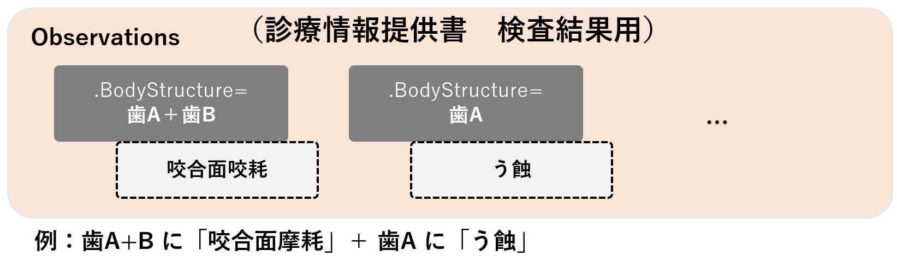

# JP Core Observation DentalOral eCS Profile - HL7 FHIR JP Core ImplementationGuide v1.3.0-dev

* [**Table of Contents**](toc.md)
* [**Artifacts Summary**](artifacts.md)
* **JP Core Observation DentalOral eCS Profile**

## Resource Profile: JP Core Observation DentalOral eCS Profile 

* **項目**: *定義URL*
  * **内容**: http://jpfhir.jp/fhir/core/StructureDefinition/JP_Observation_DentalOral_eCS
* **項目**: *Version*
  * **内容**: 1.3.0-dev
* **項目**: *Name*
  * **内容**: JP_Observation_DentalOral_eCS
* **項目**: *Title*
  * **内容**: JP Core Observation DentalOral eCS Profile
* **項目**: *Status*
  * **内容**: Active ( 2025-07-30 )
* **項目**: *Copyright*
  * **内容**: Copyright Japan FHIR Implementation Infrastructure Study Group in Japan Association of Medical Informatics (JAMI) 一般社団法人日本医療情報学会FHIR国内実装基盤研究会

 
このプロファイルはObservationリソースに対して、診療情報提供書用のデータを送受信するための制約と拡張を定めたものである。 

本プロファイルは、複数の部位が同一の疾患を有していたり、複数部位からなる疾患が存在した際に、複数の部位を表現することのできるプロファイルについて、情報の登録や検索、取得のために、FHIR Observationリソースを使用するにあたっての、最低限の制約を記述したものである。 Observation リソースに対して本プロファイルに準拠する場合に必須となる要素や、サポートすべき拡張、用語、検索パラメータを定義する。

## 背景および想定シナリオ

本プロファイルは、以下のようなユースケースを想定している。 

* 診療情報提供書用に、複数の部位が同一の疾患を有していたり、複数部位からなる疾患が存在した際に、複数の部位を表現することのできるプロファイルを示す

## スコープ

本プロファイルでは上記想定シナリオにて用いられるObservationの用途がスコープであり、診療情報提供書用に、複数の部位が同一の疾患を有していたり、複数部位からなる疾患が存在した際に、複数の部位を表現することを取り扱うために、必要な要件を定義している。 診療情報提供書用であるため、情報共有を行う特定の範囲等を示すため、全ての歯の状態は網羅されていない。



## プロファイル定義

**Usages:**

* Examples for this Profile: [Observation/jp-observation-dentaloral-ecs-example](Observation-jp-observation-dentaloral-ecs-example.md)

You can also check for [usages in the FHIR IG Statistics](https://packages2.fhir.org/xig/jpfhir.jp.core|current/StructureDefinition/jp-observation-dentaloral-ecs)

### プロファイル詳細

 [Description of Profiles, Differentials, Snapshots and how the different presentations work](http://build.fhir.org/ig/FHIR/ig-guidance/readingIgs.html#structure-definitions). 

 

Other representations of profile: [CSV](StructureDefinition-jp-observation-dentaloral-ecs.csv), [Excel](StructureDefinition-jp-observation-dentaloral-ecs.xlsx), [Schematron](StructureDefinition-jp-observation-dentaloral-ecs.sch) 

### 必須要素

本プロファイルでは、次の要素を持たなければならない。

* status : 診療情報提供書の進捗は必須とする
* category : このリソースが示す診療情報提供書を分類するための区分であり、必須とする
* code : ポートの名前/コードとして 57133-1 を指定する
* (Extension) bodySiteStatus : 特定の状態を示さない 0 を指定する
* (Extension) bodyStructure : このリソースが示す診療情報提供書用の項目が、どの複数の部位（特定の歯）の情報かを示すため、必須とする
* subject : このリソースが示す診療情報提供書用に、複数の部位が同一の疾患を有していたり、複数部位からなる疾患が存在した際に、複数の部位を表現することのできるプロファイルの項目が、どの患者のものかを示すため、このプロファイルでは参照するpatientリソースの定義を必須とする

### Extensions定義

本プロファイルでは、以下の要素を拡張する

* bodySiteStatus : 特定の状態を示さない 0 を指定する（標準歯式コード仕様の5桁目であるが、歯式にも関わらず状態を示すコードのため、状態なしである 0 を選択する）
* includedStructure : 複数の『歯』を繰り返し表現するため、このelementで示す

### サンプル

[公益社団法人 日本歯科医師会 「口腔状態モデルケースとコード化例」（2023年3月）](https://www.jda.or.jp/dentist/program/pdf/Oral-examination-Information-Standard-Code_v1.02-proportional.pdf)の記載例１１（歯冠破折２本）を参考にサンプルデータを作成した。

* [**口腔診査結果（診療情報提供書用）**](Observation-jp-observation-dentaloral-ecs-example.md)

## その他、参考文献、リンク等

* [公益社団法人 日本歯科医師会 「口腔診査情報標準コード仕様 Ver.1.02」（2023年3月）](https://www.jda.or.jp/dentist/program/pdf/Oral-examination-Information-Standard-Code_v1.02.pdf)
* [公益社団法人 日本歯科医師会 「口腔状態モデルケースとコード化例」（2023年3月）](https://www.jda.or.jp/dentist/program/pdf/Oral-examination-Information-Standard-Code_v1.02-proportional.pdf)

本実装ガイドへのご質問・ご指摘については、
[GitHub Issue](https://github.com/jami-fhir-jp-wg/jp-core-v1x/issues)および
[GitHub PullRequest](https://github.com/jami-fhir-jp-wg/jp-core-v1x/pulls)にて受け付けている。

## Resource Content

```json
{
  "resourceType" : "StructureDefinition",
  "id" : "jp-observation-dentaloral-ecs",
  "url" : "http://jpfhir.jp/fhir/core/StructureDefinition/JP_Observation_DentalOral_eCS",
  "version" : "1.3.0-dev",
  "name" : "JP_Observation_DentalOral_eCS",
  "title" : "JP Core Observation DentalOral eCS Profile",
  "status" : "active",
  "date" : "2025-07-30",
  "publisher" : "FHIR Japanese implementation research working group in Japan Association of Medical Informatics (JAMI)",
  "contact" : [
    {
      "name" : "FHIR Japanese implementation research working group in Japan Association of Medical Informatics (JAMI)",
      "telecom" : [
        {
          "system" : "url",
          "value" : "http://jpfhir.jp"
        },
        {
          "system" : "email",
          "value" : "office@hlfhir.jp"
        }
      ]
    }
  ],
  "description" : "このプロファイルはObservationリソースに対して、診療情報提供書用のデータを送受信するための制約と拡張を定めたものである。",
  "jurisdiction" : [
    {
      "coding" : [
        {
          "system" : "urn:iso:std:iso:3166",
          "code" : "JP",
          "display" : "Japan"
        }
      ]
    }
  ],
  "copyright" : "Copyright Japan FHIR Implementation Infrastructure Study Group in Japan Association of Medical Informatics (JAMI) 一般社団法人日本医療情報学会FHIR国内実装基盤研究会",
  "fhirVersion" : "4.0.1",
  "mapping" : [
    {
      "identity" : "workflow",
      "uri" : "http://hl7.org/fhir/workflow",
      "name" : "Workflow Pattern"
    },
    {
      "identity" : "sct-concept",
      "uri" : "http://snomed.info/conceptdomain",
      "name" : "SNOMED CT Concept Domain Binding"
    },
    {
      "identity" : "v2",
      "uri" : "http://hl7.org/v2",
      "name" : "HL7 v2 Mapping"
    },
    {
      "identity" : "rim",
      "uri" : "http://hl7.org/v3",
      "name" : "RIM Mapping"
    },
    {
      "identity" : "w5",
      "uri" : "http://hl7.org/fhir/fivews",
      "name" : "FiveWs Pattern Mapping"
    },
    {
      "identity" : "sct-attr",
      "uri" : "http://snomed.org/attributebinding",
      "name" : "SNOMED CT Attribute Binding"
    }
  ],
  "kind" : "resource",
  "abstract" : false,
  "type" : "Observation",
  "baseDefinition" : "http://jpfhir.jp/fhir/core/StructureDefinition/JP_Observation_Common",
  "derivation" : "constraint",
  "differential" : {
    "element" : [
      {
        "id" : "Observation",
        "path" : "Observation",
        "short" : "診療情報提供書用のプロファイル",
        "definition" : "歯科臨床においては、複数の部位が同一の疾患を有していたり、複数部位からなる疾患が存在するため、複数の部位を表現することのできるプロファイルが必要である"
      },
      {
        "id" : "Observation.identifier",
        "path" : "Observation.identifier",
        "short" : "Observationのためのビジネス識別子 【JP Core仕様】当該口腔診査（検査項目）に対して、施設内で割り振られる一意の識別子。",
        "definition" : "Observationのためのビジネス識別子 【JP Core仕様】当該口腔診査（検査項目）に対して、施設内で割り振られる一意の識別子。",
        "comment" : "例：実施日に連番を付加した番号"
      },
      {
        "id" : "Observation.basedOn",
        "path" : "Observation.basedOn",
        "short" : "実施されるプラン、提案、依頼  【JP Core仕様】未使用",
        "definition" : "実施されるプラン、提案、依頼  【JP Core仕様】未使用",
        "comment" : "本プロファイル（複数の部位が同一の疾患を有していたり、複数部位からなる疾患が存在した際に、複数の部位を表現することのできるプロファイル）は診療情報提供書に紐付く前提のため、本プロファイル特有の定義はしない。"
      },
      {
        "id" : "Observation.partOf",
        "path" : "Observation.partOf",
        "short" : "参照されるイベントの一部分 【JP Core仕様】未使用",
        "definition" : "参照されるイベントの一部分 【JP Core仕様】未使用"
      },
      {
        "id" : "Observation.status",
        "path" : "Observation.status",
        "short" : "結果の状態 【JP Core仕様】ステータス",
        "definition" : "結果の状態 【JP Core仕様】ステータス"
      },
      {
        "id" : "Observation.category",
        "path" : "Observation.category",
        "short" : "Observationの種類（タイプ）の分類 【JP Core仕様】各種Catageoryは固定となる",
        "definition" : "Observationの種類（タイプ）の分類 【JP Core仕様】各種Catageoryは固定となる",
        "comment" : "このObservationの分類。  \n【JP Core仕様】以下を指定する。  \n第1コード：exam  \n第2コード：LP89803-8（Dental）  \n第3コード：DO-1-04（ClinicalInformationSharing）",
        "min" : 3
      },
      {
        "id" : "Observation.category:first",
        "path" : "Observation.category",
        "sliceName" : "first",
        "short" : "このObservationに関する分類（JP_SimpleObservationCategory_VS）、必須項目",
        "definition" : "このObservationに関する分類（JP_SimpleObservationCategory_VS）、必須項目"
      },
      {
        "id" : "Observation.category:first.coding.code",
        "path" : "Observation.category.coding.code",
        "fixedCode" : "exam"
      },
      {
        "id" : "Observation.category:second",
        "path" : "Observation.category",
        "sliceName" : "second",
        "short" : "第2カテゴリはLOINCのコードLP89803-8固定で必須とする、ValueSetは指定しない",
        "definition" : "第2カテゴリはLOINCのコードLP89803-8固定で必須とする、ValueSetは指定しない",
        "min" : 1,
        "max" : "1"
      },
      {
        "id" : "Observation.category:second.coding.system",
        "path" : "Observation.category.coding.system",
        "fixedUri" : "http://loinc.org"
      },
      {
        "id" : "Observation.category:second.coding.code",
        "path" : "Observation.category.coding.code",
        "min" : 1,
        "fixedCode" : "LP89803-8"
      },
      {
        "id" : "Observation.category:third",
        "path" : "Observation.category",
        "sliceName" : "third",
        "short" : "このObservationに関する詳細分類、JP_ObservationDetailedDentalCategory_VSより選択する、必須項目",
        "definition" : "このObservationに関する詳細分類、JP_ObservationDetailedDentalCategory_VSより選択する、必須項目",
        "min" : 1,
        "max" : "1",
        "binding" : {
          "strength" : "required",
          "valueSet" : "http://jpfhir.jp/fhir/core/ValueSet/JP_ObservationDetailedDentalCategory_VS"
        }
      },
      {
        "id" : "Observation.category:third.coding.system",
        "path" : "Observation.category.coding.system",
        "fixedUri" : "http://jpfhir.jp/fhir/core/CodeSystem/JP_ObservationDentalCategory_CS"
      },
      {
        "id" : "Observation.category:third.coding.code",
        "path" : "Observation.category.coding.code",
        "min" : 1,
        "fixedCode" : "DO-1-04"
      },
      {
        "id" : "Observation.code.coding",
        "path" : "Observation.code.coding",
        "short" : "observation のタイプ（コードまたはタイプ 【JP Core仕様】57133-1（Referral note）を指定する",
        "definition" : "observation のタイプ（コードまたはタイプ 【JP Core仕様】57133-1（Referral note）を指定する"
      },
      {
        "id" : "Observation.code.coding.system",
        "path" : "Observation.code.coding.system",
        "fixedUri" : "http://loinc.org"
      },
      {
        "id" : "Observation.code.coding.code",
        "path" : "Observation.code.coding.code",
        "min" : 1,
        "fixedCode" : "57133-1"
      },
      {
        "id" : "Observation.code.coding.display",
        "path" : "Observation.code.coding.display",
        "patternString" : "Referral note"
      },
      {
        "id" : "Observation.subject",
        "path" : "Observation.subject",
        "short" : "観察対象者 【JP Core仕様】患者情報",
        "definition" : "観察対象者 【JP Core仕様】患者情報",
        "min" : 1,
        "type" : [
          {
            "code" : "Reference",
            "targetProfile" : ["http://jpfhir.jp/fhir/core/StructureDefinition/JP_Patient"]
          }
        ]
      },
      {
        "id" : "Observation.focus",
        "path" : "Observation.focus",
        "short" : "subject 要素が実際のobservationの対象でない場合に、observation の対象物。 【JP Core仕様】未使用",
        "definition" : "subject 要素が実際のobservationの対象でない場合に、observation の対象物。 【JP Core仕様】未使用"
      },
      {
        "id" : "Observation.encounter",
        "path" : "Observation.encounter",
        "short" : "このobservationが行われる診療イベント",
        "definition" : "このobservationが行われる診療イベント",
        "comment" : "例：診療、歯科検診"
      },
      {
        "id" : "Observation.effective[x]",
        "path" : "Observation.effective[x]",
        "short" : "臨床的に関連する時刻または時間 【JP Core仕様】実施日時",
        "definition" : "臨床的に関連する時刻または時間 【JP Core仕様】実施日時",
        "type" : [
          {
            "code" : "dateTime"
          }
        ]
      },
      {
        "id" : "Observation.issued",
        "path" : "Observation.issued",
        "short" : "このバージョンが利用可能となった日時 JP Core仕様】所見確定日時",
        "definition" : "このバージョンが利用可能となった日時 JP Core仕様】所見確定日時"
      },
      {
        "id" : "Observation.performer",
        "path" : "Observation.performer",
        "short" : "observationに責任をもつ者",
        "definition" : "observationに責任をもつ者",
        "comment" : "例：歯科医師など"
      },
      {
        "id" : "Observation.value[x]",
        "path" : "Observation.value[x]",
        "short" : "実際の結果値 【JP Core仕様】歯の処置状態。現存歯、欠損歯、粒度の細かさ、粗さにかかわらず、そのうち一つをVSより選択する",
        "definition" : "実際の結果値 【JP Core仕様】歯の処置状態。現存歯、欠損歯、粒度の細かさ、粗さにかかわらず、そのうち一つをVSより選択する",
        "type" : [
          {
            "code" : "CodeableConcept"
          }
        ],
        "binding" : {
          "strength" : "preferred",
          "valueSet" : "http://jpfhir.jp/fhir/core/ValueSet/JP_DentalTeethObservation_VS"
        }
      },
      {
        "id" : "Observation.dataAbsentReason",
        "path" : "Observation.dataAbsentReason",
        "short" : "結果が欠損値である理由 【JP Core仕様】結果が存在しなかった場合、その理由",
        "definition" : "結果が欠損値である理由 【JP Core仕様】結果が存在しなかった場合、その理由"
      },
      {
        "id" : "Observation.interpretation",
        "path" : "Observation.interpretation",
        "short" : "高、低、正常等の結果のカテゴリ分けした評価 【JP Core仕様】未使用",
        "definition" : "高、低、正常等の結果のカテゴリ分けした評価 【JP Core仕様】未使用"
      },
      {
        "id" : "Observation.note",
        "path" : "Observation.note",
        "short" : "結果に対するコメント 【JP Core仕様】未使用",
        "definition" : "結果に対するコメント 【JP Core仕様】未使用"
      },
      {
        "id" : "Observation.bodySite",
        "path" : "Observation.bodySite",
        "short" : "観察された身体部位 【JP Core仕様】未使用",
        "definition" : "観察された身体部位 【JP Core仕様】未使用"
      },
      {
        "id" : "Observation.bodySite.extension",
        "path" : "Observation.bodySite.extension",
        "min" : 2
      },
      {
        "id" : "Observation.bodySite.extension:bodySiteStatus",
        "path" : "Observation.bodySite.extension",
        "sliceName" : "bodySiteStatus",
        "short" : "【JP Core仕様】特定の状態を示さない 0 を指定",
        "definition" : "【JP Core仕様】特定の状態を示さない 0 を指定",
        "comment" : "標準歯式コード仕様の5桁目、歯式にも関わらず状態を示すコードのため、状態なしである 0 を選択",
        "min" : 1,
        "max" : "1",
        "type" : [
          {
            "code" : "Extension",
            "profile" : [
              "http://jpfhir.jp/fhir/core/Extension/StructureDefinition/JP_Observation_DentalOral_BodySiteStatus"
            ]
          }
        ]
      },
      {
        "id" : "Observation.bodySite.extension:bodySiteStatus.value[x].coding.system",
        "path" : "Observation.bodySite.extension.value[x].coding.system",
        "fixedUri" : "http://jpfhir.jp/fhir/core/CodeSystem/JP_DentalBodySiteStatus_CS"
      },
      {
        "id" : "Observation.bodySite.extension:bodySiteStatus.value[x].coding.code",
        "path" : "Observation.bodySite.extension.value[x].coding.code",
        "min" : 1,
        "fixedCode" : "0"
      },
      {
        "id" : "Observation.bodySite.extension:includedStructure",
        "path" : "Observation.bodySite.extension",
        "sliceName" : "includedStructure",
        "min" : 1,
        "max" : "*",
        "type" : [
          {
            "code" : "Extension",
            "profile" : [
              "http://jpfhir.jp/fhir/core/Extension/StructureDefinition/JP_Observation_DentalOral_BodyStructure_eCS"
            ]
          }
        ]
      },
      {
        "id" : "Observation.bodySite.extension:includedStructure.extension:structure",
        "path" : "Observation.bodySite.extension.extension",
        "sliceName" : "structure",
        "short" : "【JP Core仕様】複数の『歯』を繰り返し指定",
        "definition" : "【JP Core仕様】複数の『歯』を繰り返し指定"
      },
      {
        "id" : "Observation.bodySite.extension:includedStructure.extension:structure.value[x]",
        "path" : "Observation.bodySite.extension.extension.value[x]",
        "binding" : {
          "strength" : "required",
          "valueSet" : "http://jpfhir.jp/fhir/core/ValueSet/JP_DentalBodySite_VS"
        }
      },
      {
        "id" : "Observation.bodySite.extension:includedStructure.extension:qualifier",
        "path" : "Observation.bodySite.extension.extension",
        "sliceName" : "qualifier",
        "short" : "【JP Core仕様】特定の歯の歯根と、歯面の２項目を指定",
        "definition" : "【JP Core仕様】特定の歯の歯根と、歯面の２項目を指定"
      },
      {
        "id" : "Observation.bodySite.extension:includedStructure.extension:qualifier.value[x].coding",
        "path" : "Observation.bodySite.extension.extension.value[x].coding",
        "slicing" : {
          "discriminator" : [
            {
              "type" : "value",
              "path" : "system"
            }
          ],
          "rules" : "open"
        }
      },
      {
        "id" : "Observation.bodySite.extension:includedStructure.extension:qualifier.value[x].coding:root",
        "path" : "Observation.bodySite.extension.extension.value[x].coding",
        "sliceName" : "root",
        "short" : "特定の歯の『歯根』を指定",
        "definition" : "特定の歯の『歯根』を指定",
        "min" : 0,
        "max" : "*",
        "binding" : {
          "strength" : "required",
          "valueSet" : "http://jpfhir.jp/fhir/core/ValueSet/JP_DentalRootBodyStructure_VS"
        }
      },
      {
        "id" : "Observation.bodySite.extension:includedStructure.extension:qualifier.value[x].coding:root.system",
        "path" : "Observation.bodySite.extension.extension.value[x].coding.system",
        "min" : 1,
        "fixedUri" : "http://jpfhir.jp/fhir/core/CodeSystem/JP_DentalRootBodyStructure_CS"
      },
      {
        "id" : "Observation.bodySite.extension:includedStructure.extension:qualifier.value[x].coding:surface",
        "path" : "Observation.bodySite.extension.extension.value[x].coding",
        "sliceName" : "surface",
        "short" : "特定の歯の『歯面』を指定",
        "definition" : "特定の歯の『歯面』を指定",
        "min" : 0,
        "max" : "*",
        "binding" : {
          "strength" : "required",
          "valueSet" : "http://jpfhir.jp/fhir/core/ValueSet/JP_DentalSurfaceBodyStructure_VS"
        }
      },
      {
        "id" : "Observation.bodySite.extension:includedStructure.extension:qualifier.value[x].coding:surface.system",
        "path" : "Observation.bodySite.extension.extension.value[x].coding.system",
        "min" : 1,
        "fixedUri" : "http://jpfhir.jp/fhir/core/CodeSystem/JP_DentalSurfaceBodyStructure_CS"
      },
      {
        "id" : "Observation.method",
        "path" : "Observation.method",
        "short" : "検査方法（目視、読影など",
        "definition" : "検査方法（目視、読影など"
      },
      {
        "id" : "Observation.specimen",
        "path" : "Observation.specimen",
        "short" : "観察（観測、検査）に使われた検体材料 【JP Core仕様】未使用",
        "definition" : "観察（観測、検査）に使われた検体材料 【JP Core仕様】未使用"
      },
      {
        "id" : "Observation.device",
        "path" : "Observation.device",
        "comment" : "例：口腔内スキャナなど"
      },
      {
        "id" : "Observation.hasMember",
        "path" : "Observation.hasMember",
        "short" : "observationグループに属する関連リソース 【JP Core仕様】未使用",
        "definition" : "observationグループに属する関連リソース 【JP Core仕様】未使用"
      },
      {
        "id" : "Observation.derivedFrom",
        "path" : "Observation.derivedFrom",
        "short" : "observationの発生源に関連する測定 【JP Core仕様】未使用",
        "definition" : "observationの発生源に関連する測定 【JP Core仕様】未使用"
      },
      {
        "id" : "Observation.component",
        "path" : "Observation.component",
        "short" : "複合的な結果 【JP Core仕様】未使用",
        "definition" : "複合的な結果 【JP Core仕様】未使用"
      }
    ]
  }
}

```
