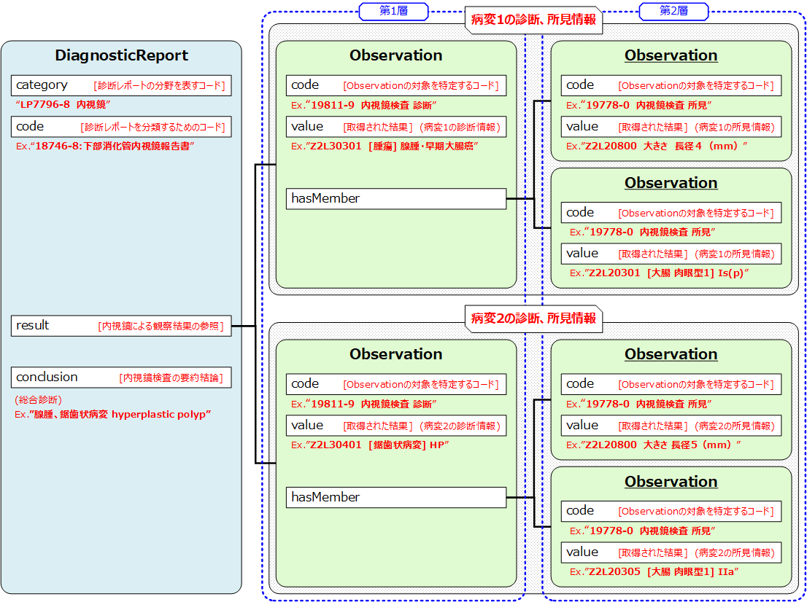

# JP Core Observation Endoscopy Profile - HL7 FHIR JP Core ImplementationGuide v1.3.0-dev

* [**Table of Contents**](toc.md)
* [**Artifacts Summary**](artifacts.md)
* **JP Core Observation Endoscopy Profile**

## Resource Profile: JP Core Observation Endoscopy Profile 

* **項目**: *定義URL*
  * **内容**: http://jpfhir.jp/fhir/core/StructureDefinition/JP_Observation_Endoscopy
* **項目**: *Version*
  * **内容**: 1.3.0-dev
* **項目**: *Name*
  * **内容**: JP_Observation_Endoscopy
* **項目**: *Title*
  * **内容**: JP Core Observation Endoscopy Profile
* **項目**: *Status*
  * **内容**: Active ( 2025-07-30 )
* **項目**: *Copyright*
  * **内容**: Copyright Japan FHIR Implementation Infrastructure Study Group in Japan Association of Medical Informatics (JAMI) 一般社団法人日本医療情報学会FHIR国内実装基盤研究会

 
このプロファイルはObservationリソースに対して、内視鏡を使用して実施された検査、治療による観察結果（診断、所見など）の情報を送受信するための制約と拡張を定めたものである。 

このプロファイルはObservationリソースに対して、内視鏡を使用して実施された検査のデータを送受信するための制約と拡張を定めたものである。 本プロファイルは、内視鏡を使用して実施された検査、治療の観察結果を記録、検索、および取得するために、Observationリソースを使用する際の、最低限の制約を記述したものである。Observationリソースに対して本プロファイルに準拠する場合に必須となる要素や、サポートすべき拡張、用語、検索パラメータを定義する。

## 背景および想定シナリオ

本プロファイルは、以下のようなユースケースを想定している。

* Patientリソースから指定された日時、期間の、内視鏡検査、治療による観察結果(診断、所見)の参照
* 内視鏡検査、治療による観察結果(診断、所見)の条件に合致する症例、または関連する他のリソース（Patientリソース、Observationリソース、Procedureリソース等）の参照

## スコープ

本プロファイルでは上記想定シナリオにて用いられるObservationの用途がスコープであり、特に内視鏡検査、治療による観察結果を取り扱う際に必要な要件を定義している。 内視鏡による観察結果を病変単位で表現するために、一つの情報項目を表現するObservationリソースを必要な情報項目数分用意し、それらを1つにグルーピングして扱う。 具体的には.hasMemberエレメントに対して関連する下位の本プロファイルを適用したObservationリソースを関連づけることでグルーピングを行う。 JP Core DiagnosticReport Endoscopyを用いて、大腸内視鏡検査レポートを表現する事例を以下に示す。 内視鏡検査レポートにおいて、診断情報は病変単位（1病変ー1レコード）で記載することが望まれている。 そのため検査レポート本体に相当するJP Core DiagnosticReport Endoscopy（第0層）に対し、

* 第1層 : 「病変単位の質的診断」
* 第2層 : 「病変単位の所見」

という情報要素を表現する本プロファイルを適用したObservationリソースを用意する。

### 例

| | | |
| :--- | :--- | :--- |
| 病変1 |   |   |
|   | 第1層 | 質的診断：腺腫 |
|   | 第2層 | 所見1：大きさ 内視鏡的長径 4mm |
|   |   | 所見2：肉眼型Is（無茎型） |
| 病変2 |   |   |
|   | 第1層 | 質的診断：鋸歯状病変 hyperplastic polyp |
|   | 第2層 | 所見1：大きさ 内視鏡的長径 5mm |
|   |   | 所見2：肉眼型IIa（表面隆起型） |



## プロファイル定義

**Usages:**

* Refer to this Profile: [JP Core DiagnosticReport Endoscopy Profile](StructureDefinition-jp-diagnosticreport-endoscopy.md) and [JP Core Observation Endoscopy Profile](StructureDefinition-jp-observation-endoscopy.md)
* Examples for this Profile: [Observation/jp-observation-endoscopy-example-diagnosis-1](Observation-jp-observation-endoscopy-example-diagnosis-1.md), [Observation/jp-observation-endoscopy-example-diagnosis-2](Observation-jp-observation-endoscopy-example-diagnosis-2.md), [Observation/jp-observation-endoscopy-example-findings-1a](Observation-jp-observation-endoscopy-example-findings-1a.md), [Observation/jp-observation-endoscopy-example-findings-1b](Observation-jp-observation-endoscopy-example-findings-1b.md)...Show 2 more,[Observation/jp-observation-endoscopy-example-findings-2a](Observation-jp-observation-endoscopy-example-findings-2a.md)and[Observation/jp-observation-endoscopy-example-findings-2b](Observation-jp-observation-endoscopy-example-findings-2b.md)
* CapabilityStatements using this Profile: [JP Core Client CapabilityStatement](CapabilityStatement-jp-client-capabilitystatement.md) and [JP Core Server CapabilityStatement](CapabilityStatement-jp-server-capabilitystatement.md)

You can also check for [usages in the FHIR IG Statistics](https://packages2.fhir.org/xig/jpfhir.jp.core|current/StructureDefinition/jp-observation-endoscopy)

### プロファイル詳細

 [Description of Profiles, Differentials, Snapshots and how the different presentations work](http://build.fhir.org/ig/FHIR/ig-guidance/readingIgs.html#structure-definitions). 

 

Other representations of profile: [CSV](StructureDefinition-jp-observation-endoscopy.csv), [Excel](StructureDefinition-jp-observation-endoscopy.xlsx), [Schematron](StructureDefinition-jp-observation-endoscopy.sch) 

### 必須要素

本プロファイルでは、次の要素を持たなければならない。

Observation リソースは、次の要素を持たなければならない。

* status :検査項目情報の状態は必須である。
* category : このリソースが内視鏡の検査項目であることを分類するために必須とする。
* code : このリソースは内視鏡を使用した観察結果の何の情報項目かを示すため必須である。
* subject : このリソースが示す内視鏡を使用した観察結果が、どの患者のものかを示すためこのプロファイルでは参照するpatientリソースの定義を必須とする。

### MustSupport

次の要素に関する情報が送信システムに存在する場合、その要素がサポートされなければならないことを意味する。（**Must Support**）

* subject : 患者リソース（Patient）への参照。殆どの場合存在するが、緊急検査等で患者リソースが確定していない場合が想定される。
* effectiveDateTime : 観察結果の確定日時。
* value : 診断レポートの一部となる内視鏡検査、治療による観察結果（診断、所見など）の情報。
* hasMember : 内視鏡による観察結果を病変単位で表現する際に使用する。

### Extensions定義

本プロファイルで追加定義された拡張はない。

## 注意事項

### category

本バージョンの実装ガイドではCategoryの第1コードとして[JP Core Simple Observation Category ValueSet][JP_SimpleObservationCategory_VS]から`procedure`を指定する。 また、第2コードとして[JP Core EndoscopyCategory ValueSet][JP_EndoscopyCategory_VS]から"Endoscopy"を表す`LP7796-8`を指定する。

### code

[JP Core Observation Endoscopy Code ValueSet](ValueSet-jp-observation-endoscopy-code-vs.md)の中から適切なコードを指定することを推奨する。

* 例：内視鏡による診断（Diagnosis Endoscopy Procedure Narrative）：`19811-9`
* 例：内視鏡による所見（Indications description Narrative Endoscopy）：`19778-0`

## 利用方法

### OperationおよびSearch Parameter 一覧

#### Search Parameter一覧

内視鏡ユースケースのSearch Parameter一覧は以下のとおり。

| | | | |
| :--- | :--- | :--- | :--- |
| MAY | based-on | reference | GET [base]/Observation?based-on=ServiceRequest/12345 |
| SHOULD | patient,code,date | reference,token,date | GET [base]/Observation?patient=123&code=http://loinc.org|19811-9&date=le2024-11-01 |
| SHOULD | patient, code-value-concept | reference, composite | GET [base]/Observation?patient=123&code-value-concept=code$http://loinc.org|19811-9,value$urn:oid:1.2.392.200270.4.1000.1|Z2L30301 |
| SHOULD | patient, code-value-concept,date | reference, composite,date | GET [base]/Observation?patient=123&code-value-concept=code$http://loinc.org|19811-9,value$urn:oid:1.2.392.200270.4.1000.1|Z2L30301&date=le2024-11-01 |
| MAY | code-value-concept,date | composite,date | GET [base]/Observation?code-value-concept=code$http://loinc.org|19811-9,value$urn:oid:1.2.392.200270.4.1000.1|Z2L30301&date=le2024-11-01 |

#### Operation一覧

ObservationリソースのOperation一覧の定義はユースケースに依存せず共通であるため、共通情報プロファイルに記載されている。

[Observation共通情報プロファイル#Operation一覧](StructureDefinition-jp-observation-common.md#operation一覧)

### サンプル

* [**内視鏡検査 診断1**](Observation-jp-observation-endoscopy-example-diagnosis-1.md)
* [**内視鏡検査 診断2**](Observation-jp-observation-endoscopy-example-diagnosis-2.md)
* [**内視鏡検査 所見1a**](Observation-jp-observation-endoscopy-example-findings-1a.md)
* [**内視鏡検査 所見1b**](Observation-jp-observation-endoscopy-example-findings-1b.md)
* [**内視鏡検査 所見2a**](Observation-jp-observation-endoscopy-example-findings-2a.md)
* [**内視鏡検査 所見2b**](Observation-jp-observation-endoscopy-example-findings-2b.md)

## その他、参考文献、リンク等

* 本プロファイルそのものの定義には影響しないが、消化器内視鏡検査の観察結果をvalueに格納する際は、日本消化器内視鏡学会が推進するJED (Japan Endoscopy Database) Projectに準拠した内容とすることを強く推奨（**SHOULD**）される。
* 2024年11月現在、JED用語のLOINC(http://loinc.org)コードを申請中である。現在、同一用語に対して異なるローカルコードが割り振られている箇所が存在するが、LOINCコード取得時に名寄せする予定である。

本実装ガイドへのご質問・ご指摘については、
[GitHub Issue](https://github.com/jami-fhir-jp-wg/jp-core-v1x/issues)および
[GitHub PullRequest](https://github.com/jami-fhir-jp-wg/jp-core-v1x/pulls)にて受け付けている。

## Resource Content

```json
{
  "resourceType" : "StructureDefinition",
  "id" : "jp-observation-endoscopy",
  "url" : "http://jpfhir.jp/fhir/core/StructureDefinition/JP_Observation_Endoscopy",
  "version" : "1.3.0-dev",
  "name" : "JP_Observation_Endoscopy",
  "title" : "JP Core Observation Endoscopy Profile",
  "status" : "active",
  "date" : "2025-07-30",
  "publisher" : "FHIR Japanese implementation research working group in Japan Association of Medical Informatics (JAMI)",
  "contact" : [
    {
      "name" : "FHIR Japanese implementation research working group in Japan Association of Medical Informatics (JAMI)",
      "telecom" : [
        {
          "system" : "url",
          "value" : "http://jpfhir.jp"
        },
        {
          "system" : "email",
          "value" : "office@hlfhir.jp"
        }
      ]
    }
  ],
  "description" : "このプロファイルはObservationリソースに対して、内視鏡を使用して実施された検査、治療による観察結果（診断、所見など）の情報を送受信するための制約と拡張を定めたものである。",
  "jurisdiction" : [
    {
      "coding" : [
        {
          "system" : "urn:iso:std:iso:3166",
          "code" : "JP",
          "display" : "Japan"
        }
      ]
    }
  ],
  "copyright" : "Copyright Japan FHIR Implementation Infrastructure Study Group in Japan Association of Medical Informatics (JAMI) 一般社団法人日本医療情報学会FHIR国内実装基盤研究会",
  "fhirVersion" : "4.0.1",
  "mapping" : [
    {
      "identity" : "workflow",
      "uri" : "http://hl7.org/fhir/workflow",
      "name" : "Workflow Pattern"
    },
    {
      "identity" : "sct-concept",
      "uri" : "http://snomed.info/conceptdomain",
      "name" : "SNOMED CT Concept Domain Binding"
    },
    {
      "identity" : "v2",
      "uri" : "http://hl7.org/v2",
      "name" : "HL7 v2 Mapping"
    },
    {
      "identity" : "rim",
      "uri" : "http://hl7.org/v3",
      "name" : "RIM Mapping"
    },
    {
      "identity" : "w5",
      "uri" : "http://hl7.org/fhir/fivews",
      "name" : "FiveWs Pattern Mapping"
    },
    {
      "identity" : "sct-attr",
      "uri" : "http://snomed.org/attributebinding",
      "name" : "SNOMED CT Attribute Binding"
    }
  ],
  "kind" : "resource",
  "abstract" : false,
  "type" : "Observation",
  "baseDefinition" : "http://jpfhir.jp/fhir/core/StructureDefinition/JP_Observation_Common",
  "derivation" : "constraint",
  "differential" : {
    "element" : [
      {
        "id" : "Observation",
        "path" : "Observation",
        "short" : "内視鏡検査、治療による観察結果（診断、所見など）の情報。【詳細参照】",
        "definition" : "内視鏡検査、治療による観察結果（診断、所見など）の情報。",
        "comment" : "内視鏡検査、治療に関するobservation（所見や診断結果など）の制約プロフィール。"
      },
      {
        "id" : "Observation.identifier",
        "path" : "Observation.identifier",
        "short" : "内視鏡に関する当該項目に対して、施設内で割り振られる一意の識別子。",
        "definition" : "内視鏡に関する当該項目に対して、施設内で割り振られる一意の識別子。"
      },
      {
        "id" : "Observation.basedOn",
        "path" : "Observation.basedOn",
        "short" : "このObservationが実施されることになった依頼や計画、提案に関する情報。【詳細参照】",
        "definition" : "このObservationが実施されることになった依頼や計画、提案に関する情報。",
        "comment" : "【JP Core仕様】オーダ情報がある場合、このプロファイルでは ServiceRequest のリソースを参照。",
        "type" : [
          {
            "code" : "Reference",
            "targetProfile" : ["http://hl7.org/fhir/StructureDefinition/ServiceRequest"]
          }
        ]
      },
      {
        "id" : "Observation.partOf",
        "path" : "Observation.partOf",
        "short" : "このObservationが親イベントの一部を成す要素であるとき、その親イベントに関する情報。【詳細参照】",
        "definition" : "このObservationが親イベントの一部を成す要素であるとき、その親イベントに関する情報。",
        "comment" : "【JP Core仕様】実施した手技の背景情報（質的診断情報など）にあたる場合 Procedure のリソースを参照。"
      },
      {
        "id" : "Observation.category",
        "path" : "Observation.category",
        "short" : "このObservationを分類するコード【詳細参照】",
        "comment" : "内視鏡検査の第1カテゴリはJP_SimpleObservationCategory_VSからprocedureを指定、第2カテゴリはLOINCのPartコードLP7796-8（内視鏡）固定とする。",
        "min" : 2,
        "mustSupport" : true
      },
      {
        "id" : "Observation.category:first",
        "path" : "Observation.category",
        "sliceName" : "first",
        "short" : "内視鏡検査の第1カテゴリはJP_SimpleObservationCategory_VSからprocedureを指定する。",
        "mustSupport" : true
      },
      {
        "id" : "Observation.category:first.coding.code",
        "path" : "Observation.category.coding.code",
        "fixedCode" : "procedure"
      },
      {
        "id" : "Observation.category:second",
        "path" : "Observation.category",
        "sliceName" : "second",
        "short" : "第2カテゴリはLOINCのPartコードLP7796-8（内視鏡）固定とする。ValueSetは指定しない",
        "definition" : "第2カテゴリはLOINCのPartコードLP7796-8（内視鏡）固定とする。ValueSetは指定しない",
        "min" : 1,
        "max" : "1",
        "patternCodeableConcept" : {
          "coding" : [
            {
              "system" : "http://loinc.org",
              "code" : "LP7796-8"
            }
          ]
        },
        "mustSupport" : true
      },
      {
        "id" : "Observation.category:second.coding.code",
        "path" : "Observation.category.coding.code",
        "min" : 1,
        "fixedCode" : "LP7796-8"
      },
      {
        "id" : "Observation.code",
        "path" : "Observation.code",
        "short" : "このObservationの対象を特定するコード。【詳細参照】",
        "definition" : "このObservationの対象を特定するコード。",
        "comment" : "19778-0（Indications description Narrative Endoscopy（所見））、19811-9（Diagnosis Endoscopy Procedure Narrative（診断））、およびLOINC申請中のJED用語の臓器毎のFindings、Diagnosis（Characterization）から選択する。JED用語のLOINCコードが取得できたらCodableConceptとして拡張予定。",
        "binding" : {
          "strength" : "preferred",
          "valueSet" : "http://jpfhir.jp/fhir/core/ValueSet/JP_ObservationEndoscopyCode_VS"
        }
      },
      {
        "id" : "Observation.subject",
        "path" : "Observation.subject",
        "min" : 1,
        "type" : [
          {
            "code" : "Reference",
            "targetProfile" : ["http://jpfhir.jp/fhir/core/StructureDefinition/JP_Patient"]
          }
        ],
        "mustSupport" : true
      },
      {
        "id" : "Observation.focus",
        "path" : "Observation.focus",
        "short" : "配偶者、親、胎児、ドナーなど、このObservationのsubject要素が実際の対象でない場合、その実際の対象に関する情報。【詳細参照】",
        "comment" : "内視鏡では省略してよい。"
      },
      {
        "id" : "Observation.effective[x]",
        "path" : "Observation.effective[x]",
        "comment" : "【JP Core仕様】effectiveDateTime：診断、所見を記載した際の日時。effectivePeriod：診断、所見以外の観察結果を記載する際、必要に応じて使用。",
        "type" : [
          {
            "code" : "dateTime"
          },
          {
            "code" : "Period"
          }
        ],
        "mustSupport" : true
      },
      {
        "id" : "Observation.value[x]",
        "path" : "Observation.value[x]",
        "short" : "内視鏡検査、治療の観察結果（診断、所見など）の情報を格納する。診断、所見の場合、病変単位で記載することが望ましい。【詳細参照】",
        "definition" : "内視鏡検査、治療の観察結果（診断、所見など）の情報を格納する。診断、所見の場合、病変単位で記載することが望ましい。",
        "comment" : "【JP Core仕様】主に診断、所見情報記載時に使用。text記載は必須とし、必要に応じてcodingも使用する。",
        "type" : [
          {
            "code" : "CodeableConcept"
          }
        ],
        "mustSupport" : true,
        "binding" : {
          "strength" : "example",
          "valueSet" : "http://jpfhir.jp/fhir/core/ValueSet/JP_ObservationEndoscopyValueJed_VS"
        }
      },
      {
        "id" : "Observation.referenceRange.type",
        "path" : "Observation.referenceRange.type",
        "short" : "参照範囲修飾子。",
        "definition" : "参照範囲修飾子。"
      },
      {
        "id" : "Observation.referenceRange.age",
        "path" : "Observation.referenceRange.age",
        "short" : "該当する場合、適用年齢。",
        "definition" : "該当する場合、適用年齢。"
      },
      {
        "id" : "Observation.hasMember",
        "path" : "Observation.hasMember",
        "short" : "内視鏡による観察結果を病変単位で表現する際、診断と所見のobservationを関連付けるためにhasMemberエレメントを使用。",
        "definition" : "内視鏡による観察結果を病変単位で表現する際、診断と所見のobservationを関連付けるためにhasMemberエレメントを使用。",
        "comment" : "【JP Core仕様】JP_Observation_Common：診断、所見以外のobservationを関連付ける場合に使用。",
        "type" : [
          {
            "code" : "Reference",
            "targetProfile" : [
              "http://jpfhir.jp/fhir/core/StructureDefinition/JP_Observation_Common",
              "http://jpfhir.jp/fhir/core/StructureDefinition/JP_Observation_Endoscopy"
            ]
          }
        ],
        "mustSupport" : true
      },
      {
        "id" : "Observation.component.referenceRange",
        "path" : "Observation.component.referenceRange",
        "short" : "コンポーネント結果の解釈のためのガイドの提供。",
        "definition" : "コンポーネント結果の解釈のためのガイドの提供。"
      }
    ]
  }
}

```
