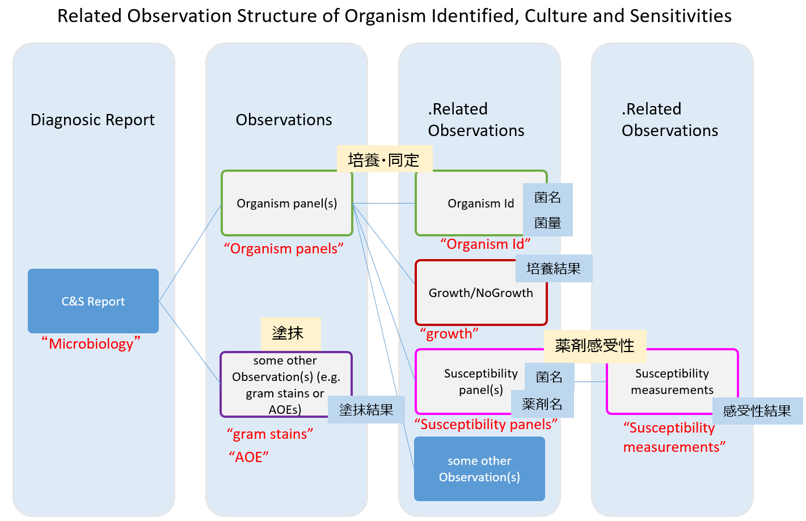

# JP Core Observation Microbiology Profile - HL7 FHIR JP Core ImplementationGuide v1.3.0-dev

* [**Table of Contents**](toc.md)
* [**Artifacts Summary**](artifacts.md)
* **JP Core Observation Microbiology Profile**

## Resource Profile: JP Core Observation Microbiology Profile 

* **項目**: *定義URL*
  * **内容**: http://jpfhir.jp/fhir/core/StructureDefinition/JP_Observation_Microbiology
* **項目**: *Version*
  * **内容**: 1.3.0-dev
* **項目**: *Name*
  * **内容**: JP_Observation_Microbiology
* **項目**: *Title*
  * **内容**: JP Core Observation Microbiology Profile
* **項目**: *Status*
  * **内容**: Active ( 2024-12-30 )
* **項目**: *Copyright*
  * **内容**: Copyright JED-Project、JAHIS、一般社団法人日本医療情報学会FHIR国内実装基盤研究会This material contains content from LOINC (http://loinc.org). LOINC is copyright © 1995+, Regenstrief Institute, Inc. and the Logical Observation Identifiers Names and Codes (LOINC) Committee and is available at no cost under the license at http://loinc.org/license. LOINC® is a registered United States trademark of Regenstrief Institute, Inc

 
このプロファイルはObservationリソースに対して、微生物学検査のデータを送受信するための制約と拡張を定めたものである。 

本プロファイル説明は、患者に関連付けられた微生物検査結果を記録、検索、および取得のために、FHIR Observationリソースを使用するにあたっての、最低限の制約を記述したものである。 Observation リソースに対して本プロファイルに準拠する場合に必須となる要素や、サポートすべき拡張、用語、検索パラメータを定義する。

なお、検査結果は、Observationリソースを参照するDiagnosticReportリソースを使用してグループ化および要約されたものである。各Observationリソースは、塗抹、培養・同定、薬剤感受性のネストされた個々の微生物検査と結果値、他の観察結果を参照する。

## 背景および想定シナリオ

本プロファイルは、以下のようなユースケースを想定している。

* 検体採取日、菌名に対し条件に合致する微生物検査情報、または関連する他のリソース（Observationリソースや、Patientリソース等）の参照
* 親リソース（兄弟リソース？）に対する追加項目として菌量を加えた条件に合致する微生物検査情報、または関連する他のリソース（Observationリソースや、Patientリソース等）の参照
* ICT等を目的として、子リソースに対する追加項目として薬剤感受性判定値、感受性有無、薬剤名、材料（採取部位、カテーテル等）、患者情報（病棟／病室＋その先のMedicationDispenseリソースの投薬情報）を加えた条件に合致するる微生物検査情報、または関連する他のリソース（Observationリソースや、Patientリソース等）の参照
* 診療目的として、Patientリソースからの指定された（患者の）検体採取日、依頼日での微生物検査情報の参照

## スコープ

本プロファイルでは上記想定シナリオにて用いられる Observationの用途がスコープであり、特に微生物学的検査に該当する情報項目の１つを取り扱う際に、必要な要件を定義している。

本プロファイルでは微生物学的検査（一般細菌検査及び抗酸菌検査）に関わる複数の情報を一つのグループとして表現するため、一つの情報項目を表現するObservationリソースを必要な情報項目数分用意し、それらを1つにグルーピングして扱う。

具体的には .hasMemberエレメントに対して関連する下位の本プロファイルを適用したObservationリソースを関連づけることでグルーピングを行う。微生物学検査で表現する情報群については、図にて表現されるように、検査結果レポートに相当する JP_DiagnosticReport_Microbiologyに（第0層）に対し、

* 第1層 : 「培養・同定（Organism panels）」、「塗抹（Gram-stain、または AFB-stains、または Others）」
* 第2層 : 「菌名・菌量（Organism Id）」、「培養結果（growth）」、「薬剤感受性（Susceptibility panels）」
* 第3層 : 「感受性結果（Susceptibility Measurement）」

という情報要素を表現する本プロファイルを適用したObservationリソースを用意する。それぞれの層では一般微生物学検査または抗酸菌検査を実施した際に得られる以下の情報が収容されることを想定している。  

第1層は微生物学検査で順を追って行なわれる検査種別に対応した情報が収容され、最初に施行される塗抹標本の顕微鏡による鏡検に相当するcategoryである「塗抹（Gram-stain、または AFB-stains、または Others）」と、それに引き続いて行なう培養・同定検査に相当するcategoryである「培養・同定（Organism panels）」から構成される。このうち、「塗抹（Gram-stain、または AFB-stains、または Others）」についてはこの階層で検査結果が収容され、これより下の階層は存在しない。

「培養・同定（Organism panels）」は構成要素として培養・同定された各菌毎の情報を下層に持ち、一般微生物学検査では「菌名・菌量（Organism Id）」及び「薬剤感受性（Susceptibility panels）」が、抗酸菌検査ではそれらに加えて「培養結果（growth）」が下層の情報となる。 このように第2層は第1層の「培養・同定（Organism panels）」の下の階層という位置付けとなり、その構成要素である「菌名・菌量（Organism Id）」は培養された菌の菌名と菌量（定性値または定量値）の情報が一般細菌検査・抗酸菌検査ともに収容される。「薬剤感受性（Susceptibility panels）」は培養・同定検査に引き続いて行われる薬剤感受性検査の結果を示すCategoryである「感受性結果（Susceptibility Measurement）」を下層（第3層）に持つ。

同じく第2層の構成要素である「培養結果（growth）」は主として抗酸菌検査で用いられ、8週間後まで時系列に数回に渡って報告される抗酸菌培養の途中経過報告として培養結果の情報が収容される。 第3層となる「薬剤感受性（Susceptibility panels）」は上位層の培養・同定検査で同定された各菌のうちで薬剤感受性検査の対象となる菌について薬剤、最小発育阻止濃度（MIC）、判定結果の情報が収容される。

現バージョンの本プロファイルでは原虫及びウイルスについては対象として想定していないが、診療報酬点数表に於いては「細菌培養同定検査は、抗酸菌を除く一般細菌、真菌、原虫等を対象として培養を行い、同定検査を行うことを原則とする。」と記載されており、原虫についても微生物学検査の対象に含めることが必要になるケースがあり得ると考えられる。しかしながら現実の検査現場に於いて原虫は鏡検によって同定されているため、「培養・同定（Organism panels）」ではなく「塗抹（Gram-stain、または AFB-stains、または Others）」に結果を収容することが報告書としては適切と考える。

## プロファイル定義

**Usages:**

* Refer to this Profile: [JP Core DiagnosticReport Microbiology Profile](StructureDefinition-jp-diagnosticreport-microbiology.md) and [JP Core Observation Microbiology Profile](StructureDefinition-jp-observation-microbiology.md)
* CapabilityStatements using this Profile: [JP Core Client CapabilityStatement](CapabilityStatement-jp-client-capabilitystatement.md) and [JP Core Server CapabilityStatement](CapabilityStatement-jp-server-capabilitystatement.md)

You can also check for [usages in the FHIR IG Statistics](https://packages2.fhir.org/xig/jpfhir.jp.core|current/StructureDefinition/jp-observation-microbiology)

### プロファイル詳細

 [Description of Profiles, Differentials, Snapshots and how the different presentations work](http://build.fhir.org/ig/FHIR/ig-guidance/readingIgs.html#structure-definitions). 

 

Other representations of profile: [CSV](StructureDefinition-jp-observation-microbiology.csv), [Excel](StructureDefinition-jp-observation-microbiology.xlsx), [Schematron](StructureDefinition-jp-observation-microbiology.sch) 

### 必須要素

本プロファイルでは、次の要素を持たなければならない。

Observation リソースは、次の要素を持たなければならない。

* status : 検体検査情報項目の状態は必須である
* category : このリソースが示す検体検査情報項目を分類するための区分であり、このプロファイルでは必須とする
* code : このリソースは何の検体検査情報項目であるかを示すため必須である
* subject：このリソースが示す検体検査情報項目がどの患者のものかを示すためこのプロファイルでは参照するpatientリソースの定義を必須とする

### Extensions定義

本プロファイルで追加定義された拡張はない。

### 制約一覧

本プロファイルでは、以下の制約を満たさなければならない。

#### 共通

| | | | | |
| :--- | :--- | :--- | :--- | :--- |
| 1 | Warning | Observation.effective[x] | 一日を含む細かな検体採取日時を記載する必要がある。（年月のみでは不足） | Observation.effectiveDateTime.exists() implies Observation.effectiveDateTime.toString().length() >= 8 |
| 2 | Error | Observation | component または、hasMember が存在しない場合、valueが存在する必要がある。 | component.empty() and hasMember.empty()) implies  value.exists() |

#### 一般細菌

| | | | | |
| :--- | :--- | :--- | :--- | :--- |
| 3 | Error | Observation.id | categoryが、'gram stains' 、'AOE' または'Organism panels'の場合、idは上位のDiagnosticReport.result.referenceに含まれなくてはならない。例）id='obs1'のObservationは、上位のDiagnosticReportに以下の記載がある。result.reference='Observation/obs1' | Observation.category.code='gram-stains'or Observation.category.code='aoes'or Observation.category.code='organism-panels'Observation.id='obs1'DiagnosticReport.result.reference='Observation/obs1' |
| 4 | Error | Observation.id | categoryが、'Organism Id' または'Susceptibility panels'の場合、idは上位のObservation.hasMember.referenceに含まれなくてはならない。またこの上位のObservationのcategoryは'Organism panels'でなくてはならない。例）id='obs2-1'のObservationは、上位のObservationに以下の記載がある。.hasMember.reference='Observation/obs2-1' | Observation.category.code='organism-id'or Observation.category.code='susceptibility-panels'Observation.id='obs2-1'Observation.category.code='organism-panels'Observation.hasMember.reference='Observation/obs2-1' |
| 5 | Error | Observation.Code（categoryが、'Organism Id' または'Susceptibility panels'の場合） | 同じ菌の場合、同じObservation.hasMember.referenceに属し、codeが同じでなくてはならない。（この時categoryは、'Organism Id' または'Susceptibility panels'：上記参照） | Observation.category.code='organism-id'and Observation.id='obs2'Observation.category.code='susceptibility-panels' and Observation.id='obs2´Observation.code = "2152" / "Enterobacter aerogenes" |
| 6 | Error | Observation.id | categoryが、'Susceptibility measurements' の場合、idは上位のObservation.hasMember.referenceに含まれなくてはならない。またこの上位のObservationのcategoryは'Susceptibility panels'でなくてはならない。例）id='obs3-3-1'のObservationは、上位のObservationに以下の記載がある。.hasMember.reference='Observation/obs3-3-1' | Observation.category.code='susceptibility-measurements'Observation.id='obs2-1-1'Observation.category.code='susceptibility-panels'Observation.hasMember.reference='Observation/obs2-1-1' |

#### 抗酸菌

| | | | | |
| :--- | :--- | :--- | :--- | :--- |
| 8 | Error | Observation.id | categoryが、'gram stains' 、'AOE' または'Organism panels'の場合、idは上位のDiagnosticReport.result.referenceに含まれなくてはならない。例）id='obs1'のObservationは、上位のDiagnosticReportに以下の記載がある。result.reference='Observation/obs1' | Observation.category.code='gram-stains'or Observation.category.code='aoes'or Observation.category.code='organism-panels'Observation.id='obs1'DiagnosticReport.result.reference='Observation/obs1' |
| 9 | Error | Observation.id | categoryが、'Growth'、'Organism Id' または'Susceptibility panels'の場合、idは上位のObservation.hasMember.referenceに含まれなくてはならない。またこのObservationのcategoryは'Organism panels'でなくてはならない。例）id='obs4-1'のObservationは、上位のObservationに以下の記載がある。.hasMember.reference='Observation/obs4-1' | Observation.category.code='organism-id'or Observation.category.code='susceptibility-panels'Observation.id='obs4-1'Observation.category.code='organism-panels'Observation.hasMember.reference='Observation/obs4-1' |
| 10 | Error | Observation.Code（categoryが、'Organism Id' または'Susceptibility panels'の場合） | 同じ菌の場合、同じObservation.hasMember.referenceに属し、codeが同じでなくてはならない。（この時categoryは、'Organism Id' または'Susceptibility panels'：上記参照） | Observation.category.code='organism-id'and Observation.id='obs4'Observation.category.code='susceptibility-panels' and Observation.id='obs4´Observation.code = "6501" / "Micobacterium tuberculosis" |
| 11 | Warning | Observation. identifier | categoryが、'Susceptibility measurements' の場合、identifierには濃度を記載する。system = "濃度"value = "1"が必要。 | Observation.category.code='susceptibility-measurements'Observation.hasmember.identifier. system ="濃度"Observation.hasmember.identifier.identifier='1' |
| 12 | Error | Observation.id | categoryが、'Susceptibility measurements' の場合、idは上位のObservation.hasMember.referenceに含まれなくてはならない。またこのObservationのcategoryは'Susceptibility panels'でなくてはならない。例）id='obs4-2-1'のObservationは、上位のObservationに以下の記載がある。.hasMember.reference='Observation/obs4-2-1' | Observation.category.code='susceptibility-measurements'Observation.id='obs4-2-1'Observation.category.code='susceptibility-panels'Observation.hasMember.reference='Observation/obs4-2-1' |

## 利用方法

### OperationおよびSearch Parameter 一覧

#### Search Parameter一覧

ースケース独自のSearch Parameterが定義されていない場合、以下の表の内容が共通のSearch Parameterとなる。ただし、categoryパラメータおよびcodeパラメータについては、各ユースケース毎に異なる固定値および用語定義で定められたコード体系を指定することになるので注意が必要である。

| | | | |
| :--- | :--- | :--- | :--- |
| SHALL | identifier | token | GET [base]/Observation?identifier=http://myhospital.com/fhir/observation-id-system|1234567890 |
| MAY | patient,category,code,value-quantity | reference,token,token,quantity | GET [base]/Observation?patient=123&category=http://loinc.org|18725-2&code=urn:oid:1.2.392.100495.10.3.100.5.11.5.2|1216&value-quantity=gt4 |
| MAY | patient,category,code,value-quantity,date | reference,token,token,quantity,date | GET [base]/Observation?patient=123&category=http://loinc.org|18725-2&code=urn:oid:1.2.392.100495.10.3.100.5.11.5.2|1216&value-quantity=gt4&date=le2020-12-31 |
| MAY | patient,category,code,value-quantity,encounter | reference,token,token,quantity,reference | GET [base]/Observation?patient=123&category=http://loinc.org|18725-2&code=urn:oid:1.2.392.100495.10.3.100.5.11.5.2|1216&value-quantity=gt4&encounter=456 |

#### Operation一覧

ObservationリソースのOperation一覧の定義はユースケースに依存せず共通であるため、共通情報プロファイルに記載されている。

[Observation共通情報プロファイル#Operation一覧](StructureDefinition-jp-observation-common.md#operation一覧)

### サンプル

Diagnostic Reportのサンプルの一部に定義しているため、これを参照すること。

* [**一般細菌検査レポート**](DiagnosticReport-jp-diagnosticreport-microbiology-example-1.md)

## その他、参考文献、リンク等

1. 厚生労働省院内感染対策サーベイランス事業[(https://janis.mhlw.go.jp/)](https://janis.mhlw.go.jp/)

本実装ガイドへのご質問・ご指摘については、
[GitHub Issue](https://github.com/jami-fhir-jp-wg/jp-core-v1x/issues)および
[GitHub PullRequest](https://github.com/jami-fhir-jp-wg/jp-core-v1x/pulls)にて受け付けている。

## Resource Content

```json
{
  "resourceType" : "StructureDefinition",
  "id" : "jp-observation-microbiology",
  "url" : "http://jpfhir.jp/fhir/core/StructureDefinition/JP_Observation_Microbiology",
  "version" : "1.3.0-dev",
  "name" : "JP_Observation_Microbiology",
  "title" : "JP Core Observation Microbiology Profile",
  "status" : "active",
  "date" : "2024-12-30",
  "publisher" : "FHIR Japanese implementation research working group in Japan Association of Medical Informatics (JAMI)",
  "contact" : [
    {
      "name" : "FHIR Japanese implementation research working group in Japan Association of Medical Informatics (JAMI)",
      "telecom" : [
        {
          "system" : "url",
          "value" : "http://jpfhir.jp"
        },
        {
          "system" : "email",
          "value" : "office@hlfhir.jp"
        }
      ]
    }
  ],
  "description" : "このプロファイルはObservationリソースに対して、微生物学検査のデータを送受信するための制約と拡張を定めたものである。",
  "jurisdiction" : [
    {
      "coding" : [
        {
          "system" : "urn:iso:std:iso:3166",
          "code" : "JP",
          "display" : "Japan"
        }
      ]
    }
  ],
  "copyright" : "Copyright JED-Project、JAHIS、一般社団法人日本医療情報学会FHIR国内実装基盤研究会  \nThis material contains content from LOINC (http://loinc.org). LOINC is copyright © 1995+, Regenstrief Institute, Inc. and the Logical Observation Identifiers Names and Codes (LOINC) Committee and is available at no cost under the license at http://loinc.org/license. LOINC® is a registered United States trademark of Regenstrief Institute, Inc",
  "fhirVersion" : "4.0.1",
  "mapping" : [
    {
      "identity" : "workflow",
      "uri" : "http://hl7.org/fhir/workflow",
      "name" : "Workflow Pattern"
    },
    {
      "identity" : "sct-concept",
      "uri" : "http://snomed.info/conceptdomain",
      "name" : "SNOMED CT Concept Domain Binding"
    },
    {
      "identity" : "v2",
      "uri" : "http://hl7.org/v2",
      "name" : "HL7 v2 Mapping"
    },
    {
      "identity" : "rim",
      "uri" : "http://hl7.org/v3",
      "name" : "RIM Mapping"
    },
    {
      "identity" : "w5",
      "uri" : "http://hl7.org/fhir/fivews",
      "name" : "FiveWs Pattern Mapping"
    },
    {
      "identity" : "sct-attr",
      "uri" : "http://snomed.org/attributebinding",
      "name" : "SNOMED CT Attribute Binding"
    }
  ],
  "kind" : "resource",
  "abstract" : false,
  "type" : "Observation",
  "baseDefinition" : "http://jpfhir.jp/fhir/core/StructureDefinition/JP_Observation_Common",
  "derivation" : "constraint",
  "differential" : {
    "element" : [
      {
        "id" : "Observation",
        "path" : "Observation"
      },
      {
        "id" : "Observation.identifier",
        "path" : "Observation.identifier",
        "short" : "当該検査項目に対し施設内で割り振られる一意の識別子があればこれを使用する",
        "definition" : "当該検査項目に対し施設内で割り振られる一意の識別子があればこれを使用する"
      },
      {
        "id" : "Observation.basedOn",
        "path" : "Observation.basedOn",
        "short" : "このObservationが実施されることになった依頼や計画／提案に関する情報、オーダ情報（ServiceRequest）",
        "definition" : "このObservationが実施されることになった依頼や計画／提案に関する情報、オーダ情報（ServiceRequest）",
        "comment" : "【JP Core仕様】オーダ情報（ServiceRequestリソース）",
        "type" : [
          {
            "code" : "Reference",
            "targetProfile" : ["http://hl7.org/fhir/StructureDefinition/ServiceRequest"]
          }
        ]
      },
      {
        "id" : "Observation.partOf",
        "path" : "Observation.partOf",
        "short" : "このObservationが親イベントの一部を成す要素であるときこの親イベントに関する情報、未使用",
        "definition" : "このObservationが親イベントの一部を成す要素であるときこの親イベントに関する情報、未使用"
      },
      {
        "id" : "Observation.category",
        "path" : "Observation.category",
        "comment" : "【JP Core仕様】日本では適切なコード体系が存在しないため、独自のバリューセットを定義する  \nJP CoreとしてはsimpleObservationコード体系を必須とし、他のローカルコード等を使用する場合はCategory要素の2つ目以降に設定する",
        "min" : 2
      },
      {
        "id" : "Observation.category:first",
        "path" : "Observation.category",
        "sliceName" : "first",
        "short" : "このObservationに関する分類（JP_SimpleObservationCategory_VS）、必須項目",
        "definition" : "このObservationに関する分類（JP_SimpleObservationCategory_VS）、必須項目"
      },
      {
        "id" : "Observation.category:first.coding.code",
        "path" : "Observation.category.coding.code",
        "fixedCode" : "laboratory"
      },
      {
        "id" : "Observation.category:second",
        "path" : "Observation.category",
        "sliceName" : "second",
        "short" : "第2カテゴリはLOINCのコード18725-2固定とする、ValueSetは指定しない",
        "definition" : "第2カテゴリはLOINCのコード18725-2固定とする、ValueSetは指定しない",
        "min" : 1,
        "max" : "1",
        "patternCodeableConcept" : {
          "coding" : [
            {
              "system" : "http://loinc.org",
              "code" : "18725-2"
            }
          ]
        }
      },
      {
        "id" : "Observation.category:second.coding.code",
        "path" : "Observation.category.coding.code",
        "min" : 1,
        "fixedCode" : "18725-2"
      },
      {
        "id" : "Observation.category:second.coding.display",
        "path" : "Observation.category.coding.display",
        "patternString" : "Microbiology studies (set)"
      },
      {
        "id" : "Observation.category:third",
        "path" : "Observation.category",
        "sliceName" : "third",
        "short" : "このObservationに関する詳細分類、JP_MicrobiologyCategory_VSより選択する、任意項目",
        "definition" : "このObservationに関する詳細分類、JP_MicrobiologyCategory_VSより選択する、任意項目",
        "min" : 0,
        "max" : "1",
        "binding" : {
          "strength" : "required",
          "valueSet" : "http://jpfhir.jp/fhir/core/ValueSet/JP_MicrobiologyCategory_VS"
        }
      },
      {
        "id" : "Observation.category:third.coding.system",
        "path" : "Observation.category.coding.system",
        "fixedUri" : "http://jpfhir.jp/fhir/core/CodeSystem/JP_MicrobiologyCategory_CS"
      },
      {
        "id" : "Observation.code.coding",
        "path" : "Observation.code.coding",
        "slicing" : {
          "discriminator" : [
            {
              "type" : "value",
              "path" : "system"
            }
          ],
          "rules" : "open"
        },
        "short" : "このObservationの対象を特定するコード",
        "definition" : "このObservationの対象を特定するコード",
        "comment" : "【JP Core仕様】[Slicing](http://hl7.org/fhir/R4/profiling.html#slicing)を使用して複数のコード体系に対応  \n基本方針としてカテゴリに応じた標準コードの使用を想定しているが、ローカルコードを使用してもよい"
      },
      {
        "id" : "Observation.code.coding:infectious-agent",
        "path" : "Observation.code.coding",
        "sliceName" : "infectious-agent",
        "short" : "同定菌名を表現する場合に使用するコード、JANIS菌名コードを利用",
        "definition" : "同定菌名を表現する場合に使用するコード、JANIS菌名コードを利用",
        "comment" : "【JP Core仕様】同定菌名を表現する場合に使用する  \nNeXEHRSで使用を定める標準コードに準じて、JANIS菌名コードを採用する",
        "min" : 0,
        "max" : "1",
        "binding" : {
          "strength" : "required",
          "valueSet" : "http://jpfhir.jp/fhir/core/ValueSet/JP_Microbiology_InfectiousAgent_VS"
        }
      },
      {
        "id" : "Observation.code.coding:infectious-agent.system",
        "path" : "Observation.code.coding.system",
        "min" : 1,
        "fixedUri" : "urn:oid:1.2.392.100495.10.3.100.5.27.6.1"
      },
      {
        "id" : "Observation.code.coding:antimicrobial-drug",
        "path" : "Observation.code.coding",
        "sliceName" : "antimicrobial-drug",
        "short" : "抗菌薬コードを表現する場合に使用するコード、JANIS抗菌薬コードを利用",
        "definition" : "抗菌薬コードを表現する場合に使用するコード、JANIS抗菌薬コードを利用",
        "comment" : "【JP Core仕様】抗菌薬コードを表現する場合に使用する  \nNeXEHRSで使用を定める標準コードに準じて、JANIS抗菌薬コードを採用する",
        "min" : 0,
        "max" : "1",
        "binding" : {
          "strength" : "required",
          "valueSet" : "http://jpfhir.jp/fhir/core/ValueSet/JP_Microbiology_AntiMicrobialDrug_VS"
        }
      },
      {
        "id" : "Observation.code.coding:antimicrobial-drug.system",
        "path" : "Observation.code.coding.system",
        "min" : 1,
        "fixedUri" : "urn:oid:1.2.392.100495.10.3.100.5.11.5.2"
      },
      {
        "id" : "Observation.code.coding:jlac10",
        "path" : "Observation.code.coding",
        "sliceName" : "jlac10",
        "short" : "塗抹結果、培養・同定結果を表現する場合に使用するコード、JLAC10を利用",
        "definition" : "塗抹結果、培養・同定結果を表現する場合に使用するコード、JLAC10を利用",
        "comment" : "【JP Core仕様】塗抹結果、培養・同定結果を表現する場合に使用する  \nJLAC10コードを採用する",
        "min" : 0,
        "max" : "1",
        "binding" : {
          "strength" : "required",
          "valueSet" : "http://jpfhir.jp/fhir/core/ValueSet/JP_ObservationLabResultCode_VS"
        }
      },
      {
        "id" : "Observation.code.coding:jlac10.system",
        "path" : "Observation.code.coding.system",
        "min" : 1,
        "fixedUri" : "http://medis.or.jp/CodeSystem/master-JLAC10-17digits"
      },
      {
        "id" : "Observation.subject",
        "path" : "Observation.subject",
        "min" : 1,
        "type" : [
          {
            "code" : "Reference",
            "targetProfile" : ["http://jpfhir.jp/fhir/core/StructureDefinition/JP_Patient"]
          }
        ]
      },
      {
        "id" : "Observation.effective[x]",
        "path" : "Observation.effective[x]",
        "short" : "取得された結果が臨床的に確定された日時、検体採取日",
        "definition" : "取得された結果が臨床的に確定された日時、検体採取日",
        "comment" : "【JP Core仕様】検体採取日",
        "type" : [
          {
            "code" : "dateTime"
          },
          {
            "code" : "Period"
          }
        ]
      },
      {
        "id" : "Observation.value[x]",
        "path" : "Observation.value[x]",
        "short" : "検査によって得られた値を格納する",
        "definition" : "検査によって得られた値を格納する",
        "comment" : "【JP Core仕様】valueQuantity：同定検査の菌量（定量）、薬剤感受性結果（MIC値）を表現する場合に使用する想定  \nvalueCodeableConcept ： 同定検査の菌種を表現する場合に使用する想定  \nvalueString ： 塗抹結果、培養検査の週数・菌量を表現する場合に使用する想定",
        "type" : [
          {
            "code" : "Quantity"
          },
          {
            "code" : "CodeableConcept"
          },
          {
            "code" : "string"
          }
        ]
      },
      {
        "id" : "Observation.interpretation",
        "path" : "Observation.interpretation",
        "short" : "高、低、正常、High、low、 normal等、薬剤感受性結果（判定）を表現する場合に使用",
        "definition" : "高、低、正常、High、low、 normal等、薬剤感受性結果（判定）を表現する場合に使用",
        "comment" : "【JP Core仕様】薬剤感受性結果（判定）を表現する場合に使用する想定"
      },
      {
        "id" : "Observation.hasMember",
        "path" : "Observation.hasMember",
        "type" : [
          {
            "code" : "Reference",
            "targetProfile" : [
              "http://jpfhir.jp/fhir/core/StructureDefinition/JP_Observation_Microbiology"
            ]
          }
        ]
      }
    ]
  }
}

```
